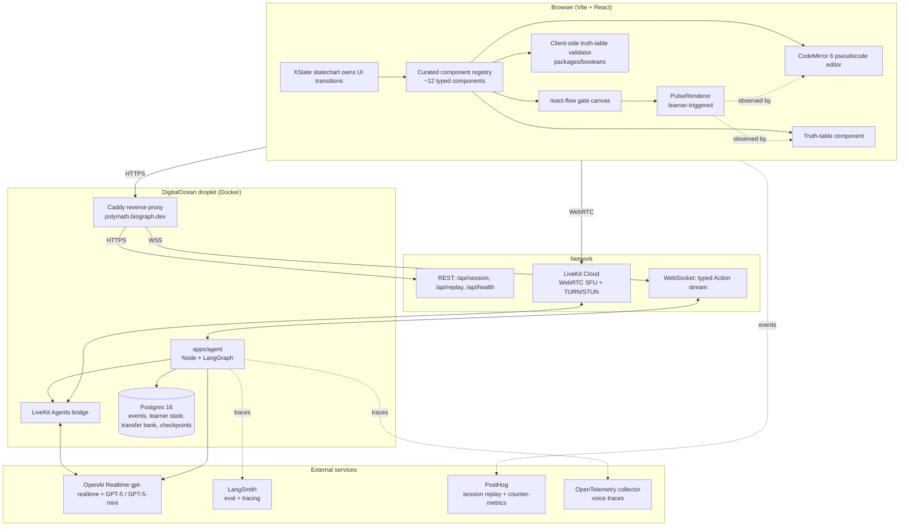
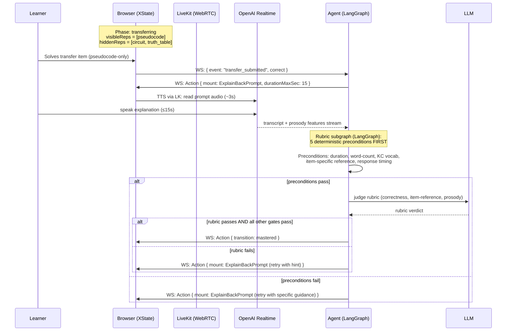

# Architecture — Polymath

**Status:** draft (Round 0–8 decisions locked) · **Last updated:** 2026-05-27
**Brief:** [`../BRIEF.md`](../BRIEF.md) · also [`../hyperresponsive-mastery-ui.pdf`](../hyperresponsive-mastery-ui.pdf)
**Research:** [RESEARCH.md](./RESEARCH.md) · **Company:** [COMPANY.md](./COMPANY.md) · **ADRs:** [docs/adrs/](./adrs/)

---

## Executive summary

**Polymath** is a multimodal hyperresponsive mastery interface for Boolean logic. The tightly scoped goal is **fluency in Boolean reasoning across three irreducibly different representations** — symbolic logic expressions, draggable gate circuits, and short pseudocode snippets. Mastery is gated by a maximalist rule (BKT estimate ≥0.95 + 3 consecutive correct at the hardest tier + 0 hints in the last 3 items + median response time 2–60s + held-out transfer item in a different surface form + voice-based explain-back that passes five deterministic preconditions before any LLM judgment) — designed so a "mastered" learner cannot have been pattern-matching, guessing, or pasting LLM-generated explanations.

The interface itself is the pedagogy: an XState statechart enforces what counts as evidence of mastery and refuses to leave a transfer probe, declare mastery without all conditions met, or end a practice item the learner hasn't acted on. A bounded inner agent (LangGraph, GPT-5 + GPT-5-mini split) proposes typed `Action` objects from a curated component registry; the statechart's guards are the truth-maker. The LLM never invents components and is on the critical path only at phase boundaries (~5–10 calls per lesson); high-frequency interactions (toggle, drag, the learner-triggered pulse-through-the-circuit) are pure client-side.

The three most consequential decisions:
1. [ADR-001](./adrs/ADR-001-learning-domain-boolean-logic.md) — Boolean logic as the domain, with mastery defined as **fluency across three representations** (chosen for irreducible transfer structure, deterministic verifiability via truth-table compare, and Hofstadter/GEB-inspired progressive curriculum).
2. [ADR-003](./adrs/ADR-003-statechart-plus-bounded-inner-agent.md) — Macro statechart owns lesson boundaries and mastery transitions; **bounded inner agent** owns intra-lesson tactics from a finite typed action menu (including conversational on-topic Q&A).
3. [ADR-004](./adrs/ADR-004-modalities-and-sensors.md) — Voice-in across the session, TTS-out only for the explain-back prompt: **voice is reframed as an LLM-cheating defense** in addition to a pedagogical signal, because audio-native models capture prosody/hesitation/restarts that an STT pipeline discards.

The MVP is **Lessons 1 (basic operators) + 2 (composition)** end-to-end with the full mastery gate and a transfer probe; stretch is **Lessons 3 (NAND universality) + 4 (De Morgan's)**; the **playground** is the beyond-stretch capstone.

The three Nerdy-specific stretch features that map to their published business strategy: **mastery telemetry in their "double growth" KPI shape** (MVP-included), **explicit FERPA / accessibility / privacy posture** (MVP-included), and a **handoff-to-human-tutor moment** (stretch, after L3+L4) — respecting their 40,000+ vetted-experts moat.

Key risks: small experimental N (5–8 subjects for the chat-baseline comparison); transfer-bank size (~32 items, growable); 24-hour false-positive mastery rate is *designed-for* but *measured only on baseline experiment subjects* in MVP scope. All documented honestly in the Limitations memo.

---

## System overview

### Component diagram



The browser holds **all high-frequency interaction**: toggling truth-table inputs, dragging gates, editing pseudocode, running the pulse-through animation, validating submissions against a target. None of these touch the network. The XState statechart is the source of truth for *when* the UI may change.

The agent service (Node + LangGraph on the droplet) holds the multi-step LLM reasoning for the moments where judgment is needed: proposing the next action, evaluating an explain-back, deciding whether mastery conditions are met. It exposes a WebSocket stream of typed `Action` objects to the browser and a thin REST API for session bootstrap.

Voice flows over WebRTC through **LiveKit Cloud** to **OpenAI Realtime** (`gpt-realtime`). The agent service runs a LiveKit Agents bridge that proxies between the room and the realtime model.

**Observability is split across three tools** at their respective sweet spots: LangSmith for LLM-call tracing and eval pipelines, PostHog for session replay and product-analytics counter-metrics, OpenTelemetry for voice-loop latency traces.

### Data flow — one practice turn

```mermaid
sequenceDiagram
  participant L as Learner
  participant B as Browser (XState)
  participant V as Validator (client)
  participant A as Agent (LangGraph)
  participant DB as Postgres
  participant LLM as OpenAI

  L->>B: Drag a gate, wire it, press "Test it"
  B->>B: PulseRenderer animates propagation<br/>(no network)
  L->>B: Press "Submit"
  B->>V: validate(circuit, targetExpression)
  V-->>B: equivalent: true/false (truth-table compare)
  B->>A: WS: { event: "submitted", correct, circuit, timing }
  A->>DB: append event row
  A->>DB: update BKT, behavioral signals
  A->>LLM: structured-output call:<br/>"propose next Action"
  LLM-->>A: { type: "mount", component: ..., rationale: "..." }
  A->>A: Layer 2 validation:<br/>recompute claimed truth-table
  alt validation passes
    A->>B: WS: Action emit
    B->>B: statechart guard checks; mount or reject
  else validation fails
    A->>LLM: retry with error feedback
  end
  B->>L: render new component
```

The critical path is **L → B → V → B** for the immediate correctness verdict (<5ms, no network). The agent's proposal for what comes next is downstream of that — the learner sees their answer marked correct *before* the agent has decided what to mount next. This separation is load-bearing for the felt-alive responsiveness.

### Data flow — explain-back transfer probe



The explain-back is the **integrity boundary**: deterministic preconditions catch trivial cheating (empty response, off-topic, generic-keyword stuffing, item-irrelevant); only after preconditions pass does the LLM judge content. The bounded ≤15s window and item-specific reference requirement together make pasting an LLM response from a side panel structurally hard — the learner does not have time to consult an external LLM about the specific item in front of them.

---

## Decision index

| ADR | Decision | Status | Stretch |
|-----|----------|--------|---------|
| [ADR-001](./adrs/ADR-001-learning-domain-boolean-logic.md) | Boolean logic as the learning domain; mastery = fluency across three representations | Accepted | no |
| [ADR-002](./adrs/ADR-002-curriculum-scope-and-mvp-cut.md) | Progressive curriculum L1–L5; MVP = L1+L2; Stretch = L3+L4; Capstone = L5 | Accepted | no |
| [ADR-003](./adrs/ADR-003-statechart-plus-bounded-inner-agent.md) | Macro statechart owns lesson boundaries and mastery transitions; bounded inner agent owns intra-lesson tactics + on-topic Q&A | Accepted | no |
| [ADR-004](./adrs/ADR-004-modalities-and-sensors.md) | Voice-in + mouse/keyboard inputs; three reps + TTS-for-explain-back-only + restrained motion + learner-triggered pulse outputs; no multi-device | Accepted | no |
| [ADR-005](./adrs/ADR-005-adaptive-ui-runtime-contract.md) | Hand-rolled typed component registry (~12 components); agent emits structured Actions with logged rationales; LLM only at phase boundaries; three explicit refusals | Accepted | no |
| [ADR-006](./adrs/ADR-006-voice-and-agent-llm-stack.md) | OpenAI Realtime via LiveKit Agents for voice; GPT-5 + GPT-5-mini split for inner agent behind provider-agnostic abstraction; LangSmith + PostHog + OpenTelemetry for observability | Accepted | no |
| [ADR-007](./adrs/ADR-007-orchestration-division-of-labor.md) | XState (UI) + LangGraph (server-side agent) + LangChain (thin provider abstraction) + LangSmith (eval) | Accepted | no |
| [ADR-008](./adrs/ADR-008-frontend-and-client-architecture.md) | Vite + React + React Router; react-flow gate canvas; CodeMirror 6 pseudocode editor; Framer Motion + View Transitions + custom PulseRenderer | Accepted | no |
| [ADR-009](./adrs/ADR-009-backend-persistence-and-hosting.md) | WebSocket + thin REST; Postgres in Docker + Drizzle ORM; DigitalOcean droplet + Caddy at polymath.biograph.dev; LiveKit Cloud | Accepted | no |
| [ADR-010](./adrs/ADR-010-content-correctness-and-validation.md) | Five-layer validation: truth-table compare for submissions; agent-commits-answer for items; templated hints; deterministic preconditions + LLM judge for explain-back; hand-curated transfer bank | Accepted | no |
| [ADR-011](./adrs/ADR-011-evaluation-and-mastery-instrumentation.md) | Mastery gate parameters (BKT 0.95 + consecutive-3 + 2/60s + behavioral flags + transfer + explain-back); six counter-metrics; N=5–8 wizard-of-oz chat-baseline comparison | Accepted | no |
| [ADR-012](./adrs/ADR-012-stretch-features-for-nerdy.md) | Three MVP+ features (Nerdy-KPI-shape telemetry, FERPA/accessibility writeup, cross-lesson recall); stretch order L3 → L4 → Handoff-to-tutor → Teacher artifact → L5 Playground | Accepted | mixed |

The ADR files are the source of truth; this index exists so a reader can find decisions. ADRs are not modified after acceptance — superseded decisions get a new ADR with `Supersedes: ADR-NNN`.

---

## Stretch features

### Locked into MVP (small, high-leverage Nerdy-fit)

- **Mastery telemetry in Nerdy's KPI shape** — a `/session/:id/report` dashboard view that emits pre/post-test, time-on-task, transfer success, and a normalised "growth multiplier" matching the shape of Nerdy's public *"double growth in core subjects"* claim. Build cost ~1 day. Depends on [ADR-011](./adrs/ADR-011-evaluation-and-mastery-instrumentation.md).
- **FERPA / accessibility / privacy posture** — both built (no facial-affect, no webcam access, WCAG 2.1 AA contrast, keyboard-first nav, reduced-motion honored, session-data deletion default) and written (a ~200-word section in the decision log). Build cost ~half day for the writing; accessibility audit folded into week-3 polish. Depends on [ADR-004](./adrs/ADR-004-modalities-and-sensors.md), [ADR-008](./adrs/ADR-008-frontend-and-client-architecture.md), [ADR-012](./adrs/ADR-012-stretch-features-for-nerdy.md).
- **Cross-lesson recall instrumentation** — a visible `CrossLessonRecall` component triggered by the agent in Lesson 2 to demonstrate the architecture's value across lessons. Build cost ~1 day. Depends on [ADR-002](./adrs/ADR-002-curriculum-scope-and-mvp-cut.md), [ADR-005](./adrs/ADR-005-adaptive-ui-runtime-contract.md).

### Stretch, in priority order

1. **Lesson 3 — NAND universality.** The aha demo moment: every Boolean function from NAND alone. Depends on the full MVP architecture extending across new content; demonstrates Hofstadter-style "deep symmetry as payoff" pedagogy. [ADR-001](./adrs/ADR-001-learning-domain-boolean-logic.md), [ADR-002](./adrs/ADR-002-curriculum-scope-and-mvp-cut.md).
2. **Lesson 4 — De Morgan's law.** Closes the curriculum arc; defends against Almstrum's *halfway application* misconception by name. [ADR-001](./adrs/ADR-001-learning-domain-boolean-logic.md), [ADR-002](./adrs/ADR-002-curriculum-scope-and-mvp-cut.md).
3. **Handoff-to-human-tutor moment.** *The* on-portfolio flex for Nerdy. A polished UI artifact at session end summarising what the learner mastered, where they got stuck, and what to bring to their next live tutoring session. Respects the 40,000+ vetted-experts moat. Build cost ~2 days. Depends on [ADR-012](./adrs/ADR-012-stretch-features-for-nerdy.md).
4. **Teacher-side artifact in VT4S shape.** Per-KC mastery + misconception flags + suggested next-session focus, matching the existing "Teacher Copilot" / 40+ teacher tools surface. Reuses the handoff summarisation pipeline. Build cost ~2 days incremental. [ADR-012](./adrs/ADR-012-stretch-features-for-nerdy.md).
5. **Lesson 5 — Playground.** Free-build mode; learner proposes a target, the system challenges them to express it across all three representations. Beyond-stretch capstone. [ADR-002](./adrs/ADR-002-curriculum-scope-and-mvp-cut.md).

Decision rule: at each weekly checkpoint, complete the highest-priority stretch item that is achievable in the remaining time without compromising MVP polish. Cut stretch decisively before sacrificing MVP polish.

---

## Non-goals

Deliberate omissions, each with the reason it's *not* in scope:

- **Multi-device / phone-camera handwriting companion.** Boolean logic does not have a natural handwriting workflow the way physics or chemistry does. Building it would be doing multi-device for the flex, not for a real learner need — which the brief explicitly penalises. Documented as a defensible future direction for handwriting-native domains. [ADR-004](./adrs/ADR-004-modalities-and-sensors.md).
- **Facial affect, eye tracking, posture detection via webcam.** Privacy-hostile for Nerdy's K-12 audience (FERPA-adjacent); the brief explicitly penalises "use camera or sensors without a clear learning benefit." [ADR-004](./adrs/ADR-004-modalities-and-sensors.md), [ADR-012](./adrs/ADR-012-stretch-features-for-nerdy.md).
- **TTS for hints, item introductions, mastery celebrations.** Text is faster to scan and re-reference; TTS is reserved for the explain-back prompt only, where its asymmetry with voice-in reinforces the anti-cheat thesis. [ADR-004](./adrs/ADR-004-modalities-and-sensors.md), [ADR-006](./adrs/ADR-006-voice-and-agent-llm-stack.md).
- **LLM-generated transfer items.** Transfer is the mastery gate's hardest checkpoint; transfer items are *never* LLM-generated. Hand-curated bank of ~32 items, committed week 1. [ADR-002](./adrs/ADR-002-curriculum-scope-and-mvp-cut.md), [ADR-010](./adrs/ADR-010-content-correctness-and-validation.md).
- **Generative UI in the brief-penalised sense.** The LLM never emits component trees, JSX, HTML, or freeform layouts. It picks from a typed enum of ~12 hand-designed components. The component library is the vocabulary; the statechart is the grammar; the LLM fills slots. [ADR-005](./adrs/ADR-005-adaptive-ui-runtime-contract.md).
- **NASA-TLX cognitive-load self-report instrument.** Defensible polish; ~30s of friction per session. Deferred — the six counter-metrics already cover the brief's named concerns. [ADR-011](./adrs/ADR-011-evaluation-and-mastery-instrumentation.md).
- **24-hour false-positive mastery measurement at scale.** Out of scope to measure at scale; *in scope* to design for. Measured only on the N=5–8 baseline-experiment subjects. Documented in the Limitations memo. [ADR-011](./adrs/ADR-011-evaluation-and-mastery-instrumentation.md).
- **AWS / GCP deployment.** The portal lists these under "cloud platforms" but the submission criterion is a working prototype, not a specific cloud. We deploy to Keith's existing DigitalOcean droplet pattern; the AWS-equivalent architecture is documented in [ADR-009](./adrs/ADR-009-backend-persistence-and-hosting.md).
- **User accounts, authentication, multi-tenant data isolation.** Opaque session tokens; no PII; suitable for prototype, documented as a production-migration concern.
- **Mobile app, tablet app, native clients.** Web-only.

---

## Open questions

Issues unresolved at planning lock-in time. Each becomes a new ADR or a documented decision when answered.

1. **The exact identities of Harrison Glenn and Tom Bauer** (brief contacts at varsitytutors.com). COMPANY.md flags both as not surfacing on public LinkedIn; recommended verification via logged-in LinkedIn before the defense. May affect demo emphasis: if they are PM/EM-level, the demo leans practical and architectural; if director-level, it leans strategic.
2. **Exact realtime/video vendor for Nerdy's Live Learning Platform.** Whether they're on Twilio, Daily, Agora, or in-house WebRTC is not publicly disclosed. Doesn't change our build (we use LiveKit Cloud) but informs how the *handoff-to-tutor* artifact frames the workspace-state transfer.
3. **Tuning of BKT parameters after first eval data.** [ADR-011](./adrs/ADR-011-evaluation-and-mastery-instrumentation.md) commits to Corbett-Anderson defaults; week-3 data may shift them. The lesson-config JSON pattern makes re-tuning a config change, not a code change.
4. **Final shape of the handoff-to-tutor artifact.** PDF? Shareable URL? In-product card? Decision deferred to stretch-implementation week.
5. ~~**Whether the playground (L5 capstone) lives in its own substate or its own micro-statechart.**~~ **RESOLVED by [ADR-013](./adrs/ADR-013-playground-micro-statechart.md): its own micro-statechart (a sibling machine), composed after the lesson machine's `mastered` final state. The locked lesson spine is untouched.** Free-build mode is structurally different from directed practice; [ADR-002](./adrs/ADR-002-curriculum-scope-and-mvp-cut.md) acknowledged this and deferred the choice to implementation time.
6. **Whether to add a fourth refusal** ("interface refuses to reveal the answer") to [ADR-005](./adrs/ADR-005-adaptive-ui-runtime-contract.md). Could strengthen the integrity story; could feel adversarial. Deferred to be decided by eval data from baseline experiment subjects.
7. **CodeMirror language extension scope.** [ADR-008](./adrs/ADR-008-frontend-and-client-architecture.md) commits to syntax highlighting for our ~5-keyword Boolean-pseudocode grammar; whether to add autocomplete, error squiggles, or in-editor truth-table preview is deferred to implementation.
8. **The exact threshold for prosody-based reading-vs-thinking detection in the explain-back rubric.** [ADR-006](./adrs/ADR-006-voice-and-agent-llm-stack.md), [ADR-010](./adrs/ADR-010-content-correctness-and-validation.md) commit to using the signal; tuning the threshold depends on eval data (the false-accept and false-reject rates on the labelled explain-back bank).
