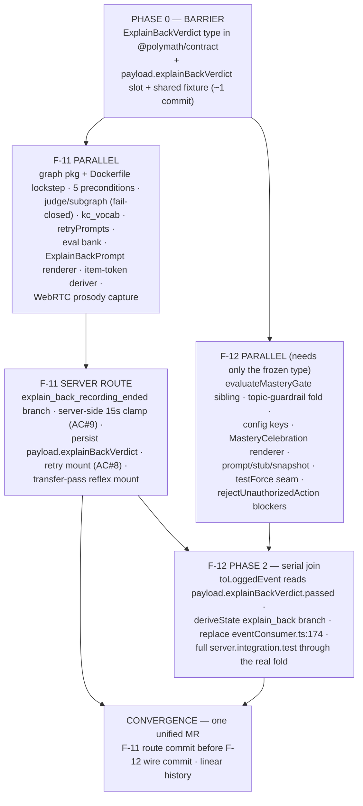

# BUILD-PLAN — Iteration 2 remainder (F-11 + F-12)

**Status:** Approved 2026-05-28 (Keith) · **Date:** 2026-05-28 · **Planner:** kmaz-plan-iteration
(9 agents: architect/researcher/contrarian × 2 features → 2 judges → 1 reconciler)

**Scope:** the remaining two features of **I2 — Voice + full mastery gate**. F-10 (LiveKit) is
already merged. This iteration closes I2 and unblocks I3 (Lesson 2).

- **F-11** — [Explain-back rubric subgraph](./features/11-explain-back-rubric.md) (5 deterministic preconditions + LLM judge)
- **F-12** — [Full mastery gate integration](./features/12-full-mastery-gate.md) (all 4 conditions)

This is a **serial pair** (F-11 → F-12), not an independent fan-out — but it parallelizes around one
tiny barrier (see DAG). Per [ROADMAP.md](./ROADMAP.md): "I2 has limited internal parallelism because
the three features build on each other."

> **Headline finding:** F-01 locked the I2 contracts more thoroughly than the F-11/F-12 specs (written
> pre-F-01) assumed. **No new wire/Action/ComponentSpec variants are needed.** Both features are
> wiring + truth-making over already-locked, currently-inert contracts. The one genuinely new shared
> type is the **explain-back verdict shape**.

---

## Approved decisions

These were decided in conversation (the two consequential ones) and at the reconciler's recommended
defaults (the rest). The build inherits them.

| # | Decision | Choice |
|---|----------|--------|
| 1 | **Prosody (F-11 AC#10)** | **Route explain-back through the WebRTC bridge** (full fidelity — chosen over descope). Explain-back audio flows over the F-10 `RealtimeSession` seam; prosody features feed the judge. *Largest-scope item in I2.* |
| 2 | **Topic-guardrail semantics** | Count **off-topic answers the agent GAVE** (persisted `answer_question` Actions tagged `off_topic`), NOT learner questions. Budget = 3. A correctly-refused off-topic question does not penalize the learner. |
| 3 | Verdict type home | `packages/contract` (`@polymath/contract`), re-exported — so the agent reads it without a `@polymath/graph` dep (no Dockerfile change for F-12). |
| 4 | Persistence slot | `payload.explainBackVerdict` in the explain-back turn's `events` row, mirroring `payload.transferVerdict` (server.ts:649). |
| 5 | Gate refactor | **Sibling + delegate:** add `evaluateMasteryGate → {passed, blockers}`; `isMastered = evaluateMasteryGate(...).passed`. Preserves the boolean signature server.ts:357 + tests depend on. |
| 6 | Transfer-pass trigger | **Deterministic server-side reflex** mounts `ExplainBackPrompt` — NOT an LLM menu move. Off the forgeable path, out of the menu lockstep. |
| 7 | AC#3 enforcement | **Server `rejectUnauthorizedAction`** is the truth-maker (the XState machine is not driven at agent runtime — verified). `?testForce=mastered` is dev-only / `NODE_ENV` gated. |
| 8 | `requireDifferentRepresentation` | Subsumed by F-07's hidden-reps transfer mechanism (verified set true in config but unread by `isMastered`). Not a new condition. |
| 9 | Eval CI gate timing | Text-only synthetic stand-ins until the ~30 real recordings land (matches the existing skip-offline/run-on-key eval pattern); offline preconditions-vs-labels assertion always green. |
| 10 | Threshold-key name | `explainBackJudgeAgreementThreshold` (single name both features set/read). |

---

## Frozen shared contracts

Both features must agree on these exactly. Source-of-truth file in each entry.

### 1. The verdict shape — THE load-bearing F-11→F-12 seam

`packages/contract/src/explainBack.ts` (NEW, re-exported from `@polymath/contract`):

```ts
export interface ExplainBackVerdict {
  passed: boolean;
  reasons: string[];            // empty on pass; precondition/judge-fail reasons otherwise
  llmJudgmentDetail?: Record<string, unknown>;  // opaque sub-scores
}

export type PreconditionReason =
  | 'duration_too_short' | 'duration_too_long' | 'too_few_words'
  | 'no_kc_vocab' | 'no_item_reference'
  | 'judge_unavailable';        // FAIL-CLOSED: no key / judge throw / missing judge
```

Lives in `packages/contract` (not `packages/graph`) so the agent reads it without a graph workspace
dep. `packages/graph` imports it from `@polymath/contract` (graph already depends on contract).

### 2. Persistence slot (internal JSONB convention — NOT a Zod wire change)

F-11 writes `payload.explainBackVerdict = { passed, reasons, llmJudgmentDetail? }` into the
explain-back turn's `events` row, mirroring `payload.transferVerdict` (verified server.ts:649).
F-12's `toLoggedEvent` reads `payload.explainBackVerdict.passed`. **Append-only; freeze jointly via a
shared test fixture before either side wires it.**

### 3. `eventConsumer.ts` projection (the SHARED convergence file — merge both field sets)

- `LoggedEvent` gains `explainBackPassed?: boolean` (F-11) **and** `offTopic?: boolean` (F-12).
- `DerivedState` gains `explainBackPassed: boolean` (init false, F-11) **and** `offTopicCount: number` (init 0, F-12).
- `deriveState` gains an `explain_back_recording_ended` branch (F-11) **and** off-topic counting on the `answer_question` projection (F-12).
- `toLearnerState`: replace `explainBackPassed: false` at **line 174** with the derived value (F-11); replace `topicGuardrailClean: true` at **line 175** with `offTopicCount <= config.topicGuardrailBudget` (F-12). *(Both hardcodes verified at exactly those lines.)*

### 4. `gate.ts` mastery predicate (F-12)

```ts
export type MasteryBlocker =
  | 'rule_gate_failed' | 'transfer_not_passed'
  | 'explain_back_not_passed' | 'topic_guardrail_exceeded';
export interface MasteryGateResult { passed: boolean; blockers: MasteryBlocker[] }
export function evaluateMasteryGate(state: LearnerState, config: MasteryConfig): MasteryGateResult;
// isMastered refactors to: return evaluateMasteryGate(state, config).passed
```

`LearnerState` (already has `explainBackPassed` + `topicGuardrailClean`) and `MasteryConfig` input
signatures are **unchanged**. Rule-gate sub-blockers fold under `'rule_gate_failed'`.

### 5. `MasteryConfig` tunable keys (`packages/contract/src/lessonConfig.ts` — append-only, OPTIONAL)

```ts
topicGuardrailBudget: z.number().int().nonnegative().default(3),       // F-12
explainBackJudgeAgreementThreshold: z.number().min(0).max(1).optional(), // F-11
```

All optional/defaulted so existing `lessons/1..4/mastery_config.json` still validate (a required key
throws at `loadLesson` → agent crash at boot). Existing required keys untouched.

### 6. `LearnerSnapshot` (`apps/agent/src/agent/client.ts:68` — F-12, append-only)

Gains `explainBackPassed: boolean` + `topicGuardrailClean: boolean` alongside `ruleGatePassed`, so
the agent can organically propose mastery (F-12 AC#1).

### Already locked — NO CHANGE (verify by typecheck only)

`ComponentSpec.ExplainBackPrompt` (component.ts:87-92) + `MasteryCelebration` (105-108) +
`COMPONENT_KINDS`; the `explain_back_recording_ended` ClientEvent (wire.ts:113-118); the `mount` /
`transition` Actions; `propose_mastery_transition` in `TacticalMove` / `F05_MENU` / `compileMove` /
`openaiClient` MoveSchema enum + `toTacticalMove`. **Neither feature edits `action.ts` or the
two-place menu lockstep.**

---

## Build DAG

A serial pair with a parallel-drafting window and **one hard barrier**. The barrier is NOT "all of
F-11" — it is the **frozen verdict shape + persistence slot**, landable as a tiny first commit.



**Phase 0 (barrier):** land the `ExplainBackVerdict` type + the `payload.explainBackVerdict` slot
fixture. Single point of serialization.

**Phase 1 (parallelizable, after barrier):** F-11 and F-12 build their non-verdict-reading tracks
concurrently. F-12 wires against the shared fixture (mocked payload) for anything that reads the verdict.

**Phase 2 (serial join):** once F-11's route actually persists the verdict, F-12's explain-back-wire
step + full integration test re-point at the live path. This is the true serial dependency: F-12's
fold reads what F-11's route writes.

**Convergence:** ONE unified MR for the iteration, linear history (rebase onto main, never merge
commits — per workspace conventions). F-11's route commit lands before F-12's wire commit.

---

## Convergence points (same-file edits)

| File | F-11 | F-12 | Resolution |
|------|------|------|------------|
| `apps/web/src/components/registry.tsx:79-81` | splits `ExplainBackPrompt` out of the Tbd group | splits `MasteryCelebration` out | Both edit the same 3-line block. F-11's case lands first; F-12 targets the reduced block. End: two real cases + `ConfidenceCheck` in Tbd + `never` default intact + matching imports. |
| `apps/agent/src/mastery/eventConsumer.ts` | adds `explainBackPassed`; fixes line **174** | adds `offTopic`/`offTopicCount`; fixes line **175** | Adjacent lines, different event kinds — compose cleanly. Ensure `LoggedEvent`/`DerivedState` get BOTH field sets. |
| `apps/agent/src/server.ts toLoggedEvent` (81-95) | reads `payload.explainBackVerdict.passed` | extends the `action` projection to read `topicClassification` | Same function, different payload slots — additive, both mirror the existing `transferVerdict` read. |
| `apps/agent/src/server.ts` (357 / 649) | adds the `...(explainBackVerdict ? {explainBackVerdict} : {})` persist at 649 | switches the `transition→mastered` branch at 357 to `evaluateMasteryGate` + blocker log | Different sites; F-11 does NOT touch 357. |
| `apps/agent/src/server.integration.test.ts:264` | (provides the transfer-pass reflex it asserts on) | UPDATES the I1 `afterTransfer.type==='no_action'` assertion to I2 reality | Owned by F-12; depends on F-11's reflex + route being landed. |
| `apps/agent/src/agent/stubClient.ts:110-117` | reflex supersedes the arm for the *mount* | edits the arm so post-explain-back it proposes `propose_mastery_transition` | Same arm, different transitions — coordinate. |

---

## Shared build conventions (both workstreams)

- **FAIL CLOSED everywhere** (CLAUDE.md invariant + I1 precedent). Missing `kc_vocabulary.json` → empty list → precondition #4 fails. No key / judge throw / undefined judge → `{passed:false, reasons:['judge_unavailable']}`. No persisted verdict → `explainBackPassed` stays false → blocker → block. Boot-time data reads are non-fatal-but-FAILING (degrade-to-block), never degrade-to-pass. Kill the fail-open `topicGuardrailClean:true`.
- **Dockerfile COPY discipline.** F-11's `@polymath/graph` needs BOTH COPYs (deps-stage manifest + runtime source), done WITH the scaffold. `kc_vocabulary.json` rides under `COPY lessons lessons` — verify. Do NOT COPY `evals/`. F-12 needs no Dockerfile change (verdict type in contract). Prove with `docker build` + `docker run … ls` + `/api/health`.
- **Server-side window + earned-it enforcement** (never trust the client). The 15s window is re-enforced server-side (clamp `effectiveDurationMs = min(client.durationMs, maxDurationSec*1000)`, AC#9). `propose_mastery_transition` gets the same earned-it gate `TransferProbe` got (AC#3).
- **Var-cap all new server-side parse call sites** (CLAUDE.md). F-11's precondition-#5 token deriver reuses `MAX_SUBMIT_VARS=10`; over-cap/unknown → empty token set → fail closed.
- **Eval-as-CI-gate** (F-11 AC#6): always-on offline preconditions-vs-labels + key-gated ≥90% LLM-judge run, wired into `.gitlab-ci.yml`.
- **Drive the REAL fold in integration tests, never a hand-set `LearnerState`** (the I1 inert-refusal trap — flagged by both plans). Update `server.integration.test.ts:264`.
- **Two-place menu lockstep:** neither feature edits `menu.ts`/`openaiClient.ts`. Verify by `pnpm typecheck`.
- **One unified MR, linear history.**

---

## Model tiers

| Feature | Tier | Reason |
|---------|------|--------|
| **F-11** | **Opus** | Freezes the F-11→F-12 verdict sub-contract; new workspace package + Dockerfile-lockstep trap; the load-bearing server route + single-writer `eventConsumer`; fail-closed integrity boundary; AC#9 server-side clamp; var-cap on a new parse site; the I1 reachability trap across packages; the WebRTC prosody capture. Coordinating judgment. |
| **F-12** | **Opus** | The I2 convergence point — cross-feature persistence-shape dependency on F-11's slot; a verified fail-open landmine to flip; server-vs-statechart truth-maker subtlety; the `isMastered` sibling/delegate decision; multi-file lockstep (gate + eventConsumer + server + snapshot + prompt + stub + renderer); the integration test must drive the real fold. |

**Sonnet-delegable leaf tasks** (under an Opus coordinator, if the build orchestration wants them):
F-11's `retryPrompts.ts` (pure lookup), F-12's `MasteryCelebration.tsx` (well-specced presentational),
`kc_vocabulary.json` authoring. Everything touching `gate.ts`, `eventConsumer.ts`, `server.ts`, the
subgraph fail-closed wiring, the WebRTC capture, and the verdict/persistence barrier stays on Opus.

---

## Pre-build checklist (human)

Decisions 1–10 are locked above. Remaining human inputs before / during the build:

- [ ] **MANUAL — ~30 labelled explain-back recordings** (~1.5 days, Keith + family/friends per F-11 spec line 81). CI's ≥90% gate runs on text-only synthetic stand-ins until these land (decision #9).
- [ ] **MANUAL — author `lessons/1/kc_vocabulary.json`** (the generic L1 KC term list per ADR-010 Layer 4; ~half day). Confirm the term list.
- [ ] **Confirm the WebRTC-prosody scope** is acceptable for the I2 timeline (it is the largest-scope item; the live cross-platform smoke is deferred, needs real keys/devices).
- [ ] **AC#5 replay granularity** (minor, can default during build): existing validation/snapshot block + new `statechartReason` sufficient, or add a per-turn `gateEvaluation:{passed,blockers}` (every turn vs transfer/explain-back turns only)? *Default: add it on transfer/explain-back/mastery turns for the demo.*
- [ ] **AC#4 hot-reload** of `explainBackJudgeAgreementThreshold` (minor): restart-in-dev acceptable for MVP, or watch-based cache-bypass? *Default: restart-in-dev.*
- [ ] **`MasteryCelebration.conceptsMastered` source** (minor): learner_state KCs with BKT ≥ threshold (spec says "from learner_state"). *Default: that.*

---

## Verification (per feature)

**F-11:** `pnpm install` · `pnpm typecheck` · `pnpm --filter @polymath/graph test` ·
`pnpm --filter @polymath/agent exec vitest run src/explainback/route.test.ts` ·
`pnpm --filter @polymath/web exec vitest run src/components/ExplainBackPrompt.test.tsx` ·
`pnpm exec vitest run evals/explain_back/eval.test.ts` ·
`docker build -f apps/agent/Dockerfile -t polymath-agent:f11 .` ·
`docker run --rm --entrypoint sh polymath-agent:f11 -c 'ls -la packages/graph lessons/1/kc_vocabulary.json'` ·
`pnpm test`

**F-12:** `pnpm typecheck` · `pnpm --filter @polymath/agent exec vitest run src/mastery/gate.test.ts` ·
`pnpm --filter @polymath/agent exec vitest run src/mastery/eventConsumer.test.ts` ·
`pnpm --filter @polymath/agent exec vitest run src/server.integration.test.ts` ·
`pnpm --filter @polymath/web exec vitest run src/components/MasteryCelebration.test.tsx` ·
`pnpm --filter @polymath/contract test` · `pnpm test` ·
`docker build -f apps/agent/Dockerfile -t polymath-agent:f12 .` · `./infra/smoke.sh`

---

## How to proceed

1. **Review this manifest + the two `Build plan (approved)` sections** ([F-11](./features/11-explain-back-rubric.md), [F-12](./features/12-full-mastery-gate.md)).
2. Approve, or send edits — I'll revise the plan (the planning workflow can be resumed/iterated cheaply).
3. On approval, launch **`kmaz-build-iteration`** — it implements the Phase-0 barrier, fans out the two
   worktree-isolated workstreams, runs the adversarial review panel per feature, and returns a
   convergence report for you to land as one unified MR.
