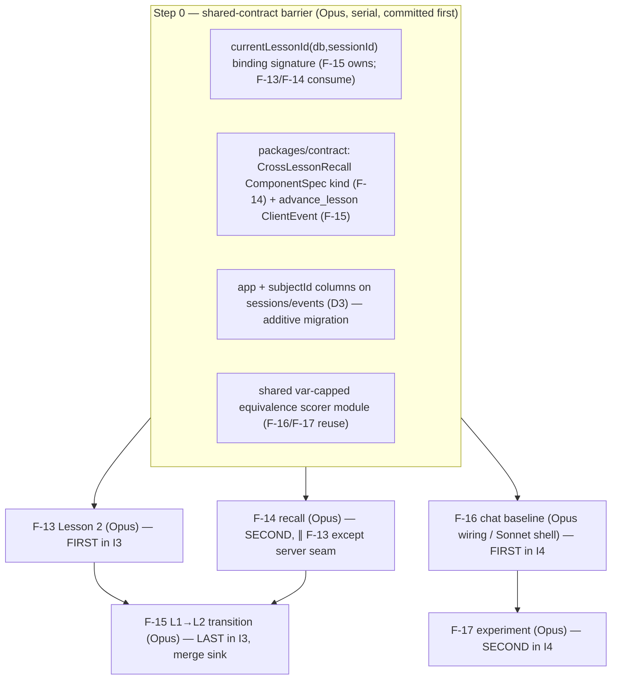

# BUILD-PLAN — I3 + I4 (Lesson 2 + cross-lesson recall + L1→L2 transition · chat baseline + experiment)

**Iteration slug:** `i3i4-lessons2-baseline` · **Status:** Awaiting approval · **Date:** 2026-05-28 · **Planner:** kmaz-plan-iteration
(15 drafting agents: architect/researcher/contrarian × 5 features → reconciled inline; every load-bearing claim verified against code.)

**Scope:** two roadmap iterations built as ONE parallel batch (the roadmap marks them concurrency-safe).

- **I3 — Lesson 2 + cross-lesson recall** (critical path): **F-13** Lesson 2 content + statechart · **F-14** cross-lesson recall · **F-15** L1→L2 macro transition (merge sink).
- **I4 — Chat baseline experiment** (contract-mediated, parallel with I3): **F-16** `apps/baseline` chat app · **F-17** experiment scaffolding.

The build branch is `build/i3i4-lessons2-baseline`; worktrees under `.claude/worktrees/i3i4-lessons2-baseline/`; convergence report `CONVERGENCE-i3i4-lessons2-baseline.md`. (The prior I2 manifest is now `docs/BUILD-PLAN-i2-explainback-mastery.md`.)

> **Headline finding:** the specs (written pre-build) assume more "designed-for parameterisation" than the code
> actually has. Three things the build must fix that the specs underplay: (1) **`lessonIdForEvent` hardcodes
> lesson 1** for every non-`session_start` turn — L2 silently runs on L1 config until fixed; (2) **the server
> runs no XState actor** — the L1→L2 "macro guard" must be real server enforcement, not client theater; (3) **the
> L1 transfer bank has only 8 items** — F-17's pre/post/followup exclusion design needs 10–14 and is infeasible as
> written. Each is verified below and carried into the per-spec checklists.

---

## Decisions (RESOLVED — Keith approved all recommended defaults, 2026-05-28)

All five gates are decided: the build adopts the **recommended default** in each row below. No open questions remain; `kmaz-build-iteration` may launch.

| # | Decision | ✅ Chosen (recommended default) | Affects |
|---|----------|---------------------|---------|
| **D1** | **F-17 item bank.** 8 L1 items can't supply 4 pre + 4 post + 2 followup distinct (needs 10–14). | ✅ **Relax AC#6**: two conditions share ONE held-out 4-item post-test; followup reuses items in a *different `targetRep`*. (`4 pre + 4 shared-post = 8` exact + rep-override followup.) | F-17 |
| **D2** | **F-16 topology.** Where the baseline's LLM call + event logging live. | ✅ **`/api/baseline/*` routes on `apps/agent`** + thin static `apps/baseline` SPA (reuses pool/Dockerfile/CI-DB/health-check/key; purely additive). | F-16, F-17 |
| **D3** | **Baseline/experiment session tagging.** Avoid polluting Polymath metrics. | ✅ **Nullable `app` column on `sessions`+`events`** (additive migration; NULL=polymath) + `subjectId` on `sessions` for F-17 linkage; F-17/F-21 filter explicitly. | F-16, F-17, F-21 |
| **D4** | **F-13 `WorkedExample` renderer (AC#3).** Currently a `<Tbd>` stub. | ✅ **Descope the web renderer** from F-13; satisfy AC#3 at the agent layer (valid `WorkedExample` spec shipped, asserted in a test). Filed as a follow-on. | F-13 |
| **D5** | **Human content/authoring** (not agent-completable). | ✅ F-13: Keith authors ~12 L2 practice items + intro prose (~1.5 days) — agent scaffolds validator-passing placeholders, **merge blocks on review**. F-17: Keith writes the IRB-light consent form (~½ day). | F-13, F-17 |

---

## Build DAG



**Critical path:** Barrier → F-13 → F-15 (F-14 joins at F-15). I4 (F-16 → F-17) runs fully concurrent.
**Worktree-isolated workstreams:** F-13, F-14, F-16 fan out after the barrier; F-15 builds after F-13+F-14 land; F-17 after F-16.

---

## Step 0 — the shared-contract barrier (freeze BEFORE fan-out)

The reason I3 underestimated convergence: **F-13, F-14, F-15 all touch `apps/agent/src/server.ts`** (the lesson-binding / reflex region) and **F-14+F-15 both touch `packages/contract`**. Freezing these four signatures in one barrier commit (on the build branch, before any feature worktree starts) removes the triple-collision.

1. **`currentLessonId(db, sessionId): Promise<number>`** — backed by `sessions.lessonProgress` (jsonb column exists, unused today). `lessonIdForEvent` (`server.ts:161-163`, currently `return event.kind==='session_start' ? event.lessonId : 1`) becomes this async lookup at the single call site `server.ts:881`. **F-15 owns the implementation + the write-on-advance; F-13 wires the read for `?lesson=2`; F-14 reads cross-lesson state through it.**

2. **`packages/contract` additions (append-only):**
   - `ComponentSpec` gains `CrossLessonRecall` (F-14): `{ kind:'CrossLessonRecall', kc:string, currentItemId:string, priorBktAtRegression:number, reminderBody:string }` — **text-only, no `visibleReps`**. Append to `COMPONENT_KINDS` + add a `componentSamples` entry (the set-equality test in `index.test.ts` enforces it). Add the `registry.tsx` case (exhaustive `never` default forces it).
   - `ClientEvent` gains `advance_lesson` (F-15): `{ kind:'advance_lesson', sessionId, toLessonId:z.number() }`. (NOT a new `Action` variant; NOT `transition.to` — that's a `PhaseName`.)

3. **`app` + `subjectId` columns** on `sessions` and `events` (D3, additive Drizzle migration; NULL=polymath). Generated by `drizzle-kit generate`, applied on agent boot.

4. **Shared var-capped equivalence scorer** — factor the `equivalent()` + ≤10-distinct-var cap + parse-error→`false` triad (today inside `recomputeCorrect`/`computeTransferVerdict`) into a module both Polymath and the baseline/experiment call. Fairness + DoS-safety depend on a single path.

> No code in any feature fans out until Step 0 is committed and `pnpm typecheck && pnpm test` is green on the build branch.

---

## Per-feature summary, model tier, and key risk

| Feature | Tier | One-line build | Top risk (verified) |
|---|---|---|---|
| **F-13** Lesson 2 | **Opus** | `lessons/2/*` content + statechart-`id` factory + L2 session binding + `?lesson=2` seam | `lessonIdForEvent` hardcodes L1 (silent L2-on-L1-config); XOR isn't parseable (AC#4 reworded); WorkedExample is a stub (D4) |
| **F-14** recall | **Opus** | `CrossLessonRecall` kind + **server reflex** (not LLM move) + regression detector + uncapped throttle | L1 BKT only exists in-session post-F-15 → standalone is seam-only demo; reflex not menu-move; text-only to avoid probe leak |
| **F-15** transition | **Opus** | `advance_lesson` reflex + server-derived L1-mastery guard + same-session re-instantiation + `nextLessonId` | server runs NO XState (guard must be server-side); **must keep same sessionId** or F-14 breaks; 500ms needs deterministic mount; `alreadyStarted` reflex collision |
| **F-16** baseline | **Opus**/Sonnet | baseline chat (server-side LLM, fair scoring, fixed-length) + SPA + deploy | D2/D3 topology+tagging; key must stay server-side; CI offline (mock LLM); fairness = same scorer/model/content |
| **F-17** experiment | **Opus** | 4 tables + boot migration + REST runners + Postgres-streamed CSV + subject↔session link | **8-item bank can't satisfy the exclusion design (D1)**; CSV-to-disk doesn't persist; no session linkage; migration blast radius = whole agent |

**Tiering rationale** (per the project convention — Opus coordinates/integrates + contract-touching/complex work; Sonnet executes isolated well-specified leaves): four of five features touch shared contract/server/statechart/deploy surfaces or carry subtle integrity invariants → Opus. Only F-16's static SPA + chat shell is a clean Sonnet leaf once D2/D3 are fixed.

---

## Frozen contract signatures (the build must not reshape these)

```ts
// packages/contract/src/component.ts — append (F-14)
z.object({ kind: z.literal('CrossLessonRecall'),
  kc: z.string(), currentItemId: z.string(),
  priorBktAtRegression: z.number(), reminderBody: z.string() })   // text-only; NO visibleReps

// packages/contract/src/wire.ts — append (F-15)
z.object({ kind: z.literal('advance_lesson'), sessionId: SessionId, toLessonId: z.number() })

// apps/agent — lesson binding (F-15 owns; barrier signature)
function currentLessonId(db: Db, sessionId: string): Promise<number>   // reads sessions.lessonProgress; default 1

// sessions / events — additive columns (D3)
app: text('app')                 // nullable; NULL = polymath, 'baseline' = F-16
subjectId: uuid('subject_id')    // nullable FK → experiment_subjects (F-17 linkage)

// F-17 CSV export — FROZEN column order (F-21 reads):
// subject_id,condition_order,pre_test_score,polymath_session_id,polymath_post_score,
// baseline_session_id,baseline_post_score,followup_score,qualitative_notes
//   scores 0.0–1.0; missing data = empty string

// F-17 exclusion backstop:
// subject_item_usage PK (subject_id, item_id)  — one item per subject, ever
```

**Untouched & verified safe:** `Action` wire union (recall + advance are `mount`/new-event, not new Action variants); `@polymath/booleans` public signatures (alphabet doesn't grow — XOR stays composition); the locked `PhaseName`/`LESSON_PHASES` shape (re-instantiation, no macro states); `transfer_bank` (read-only).

---

## Cross-cutting invariants the build must honor (CLAUDE.md / ADRs)

- **Dev/test seams** (`?lesson=2`, synthetic-L1-BKT, `?testForce=mastered`) behind `NODE_ENV!=='production' && POLYMATH_ENABLE_TEST_SEAMS==='true'` — never `NODE_ENV` alone.
- **Every server-side `equivalent()`/`truthTable()` on learner input** gets the ≤10 distinct-var cap (F-14 detector, F-16 chat scoring, F-17 test scoring are all new call sites). Over-cap = incorrect, never enumeration.
- **Monotonic signals from an UNCAPPED query** — F-14's per-KC recall throttle (like `countOffTopicAnswers`), not the bounded event fold, not in-memory.
- **Server-derived integrity** — F-15's lesson-advance guard re-derives L1 mastery server-side; never trust a client advance signal. Privileged mounts (recall) are server-minted (the reflex is the earned-it check).
- **MR CI is offline** — no `OPENAI_API_KEY` in `verify`/`agent_test`; all new LLM paths (baseline chat, L2 evals) mock the provider; live judge/eval runs only in the protected `main` job.
- **Deploy** — runtime-read dirs (`lessons/2/`) ride the existing `COPY lessons`; new workspace packages need both Dockerfile COPYs; **F-17's boot migration must be additive + `drizzle-kit generate`-only** (a bad migration crashes the agent before `/api/health` → rollback); confirm with a real `docker build` + fresh-DB boot. CSVs stream from Postgres, never written into the release tree.

---

## Verification (per feature)

**F-13:** `pnpm typecheck` · `pnpm --filter @polymath/statechart test` · `pnpm --filter @polymath/agent exec vitest run src/lessons/loader.test.ts` · `pnpm --filter @polymath/agent test` · `pnpm test` · `docker build -f apps/agent/Dockerfile -t polymath-agent:f13 .` · `docker run --rm polymath-agent:f13 ls /app/lessons` (expect `2`).

**F-14:** `pnpm typecheck` · `pnpm --filter @polymath/contract test` · `pnpm --filter @polymath/web exec tsc --noEmit` · `pnpm --filter @polymath/agent exec vitest run src/agent/regression.test.ts` · `pnpm --filter @polymath/agent test` · `pnpm test` · `docker build … -t polymath-agent:f14 .`.

**F-15:** `pnpm typecheck` · `pnpm --filter @polymath/statechart test` · `pnpm --filter @polymath/agent exec vitest run src/server.integration.test.ts` · `pnpm --filter @polymath/web test` · `pnpm test` · `docker build … -t polymath-agent:f15 .` · `./infra/smoke.sh`.

**F-16:** `pnpm typecheck` · `pnpm --filter @polymath/baseline test` · baseline route tests · `pnpm test` · `docker build` (agent + baseline) · `docker compose up --build` then `curl localhost:8080/baseline/`.

**F-17:** `pnpm typecheck` · migration test (fresh Postgres → all 4 tables) · `pnpm --filter @polymath/agent exec vitest run` (experiment suite) · `pnpm --filter @polymath/agent test` · `pnpm test` · `docker build … -t polymath-agent:f17 .` + boot against a fresh Postgres.

**Whole iteration (at the merge sink):** `pnpm typecheck && pnpm test && pnpm build` green on `build/i3i4-lessons2-baseline`; full `docker compose up --build` + `./infra/smoke.sh`; manual L1→L2 traversal via the seams; baseline session round-trip at `/baseline/`.

---

## How to proceed

1. **Make the five gate decisions** (D1–D5 above). D1 (F-17 item bank) and D2/D3 (F-16 topology+tagging) are the consequential ones; D4/D5 have safe defaults.
2. **Review the five `Build plan (approved)` sections** — [F-13](./features/13-lesson-2-composition.md), [F-14](./features/14-cross-lesson-recall.md), [F-15](./features/15-lesson-transition.md), [F-16](./features/16-chat-baseline-app.md), [F-17](./features/17-experiment-scaffolding.md) — plus this manifest. Approve, or send edits (the planning workflow can be resumed/iterated cheaply).
3. **On approval, launch `kmaz-build-iteration`** with slug `i3i4-lessons2-baseline`. It commits the Step-0 barrier, fans out F-13/F-14/F-16 in worktrees, builds F-15 (merge sink) after F-13+F-14 and F-17 after F-16, runs the adversarial review panel per feature (gating on spec+security findings), and returns `CONVERGENCE-i3i4-lessons2-baseline.md` for you to land as one unified linear MR.
