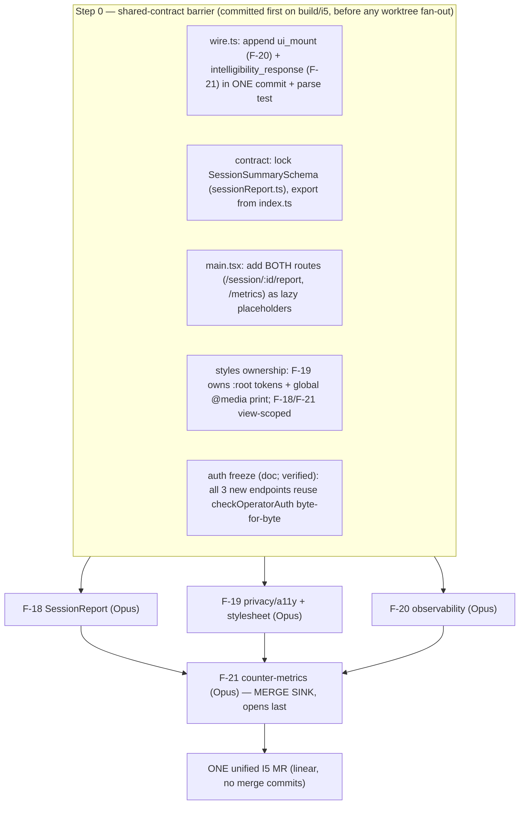

# BUILD-PLAN — I5 (MVP+ polish: SessionReport · privacy/a11y · observability · counter-metrics)

**Iteration slug:** `i5-polish-observability-metrics` · **Status:** Approved (Keith, 2026-05-29; decisions locked) — cleared for build launch concurrent with I6 · **Date:** 2026-05-29 · **Planner:** kmaz-plan-iteration
(11 planning agents: F-18/F-19 one-opus-pass through architect/reuse/contrarian lenses; F-20/F-21 escalated to a 3-draft panel + synthesis; reconciled inline. Every load-bearing claim verified against code under `apps/`, `packages/`, `ops/`, `.gitlab-ci.yml`.)

**Scope:** the four off-critical-path MVP+ features of I5 ([ROADMAP I5](./ROADMAP.md#i5--mvp-polish)). F-18/F-19/F-20 run concurrent after a shared barrier; **F-21 is the merge sink** (opens last). All depend on contracts locked in I0–I4, which are merged on `main`.

- **F-18** SessionReport dashboard (Nerdy KPI shape) — `GET /api/session/:id/report` + `/session/:id/report` route + the reusable summary pipeline (F-24/F-25 wrap it later).
- **F-19** Privacy + accessibility audit + writeup — **and the missing global stylesheet/design tokens F-18/F-21 depend on** + a fail-closed session-data deletion path.
- **F-20** Observability — first-real-wiring of PostHog + LangSmith + OTel (all currently unwired) + the agent-side UI-churn source F-21 metric-1 reads.
- **F-21** Counter-metrics dashboard (6 metrics) — `GET /api/metrics` + `/metrics` route; the **honest four-state** dashboard.

The build branch is `build/i5-polish-observability-metrics`; worktrees under `.claude/worktrees/i5-polish-observability-metrics/`; convergence report `CONVERGENCE-i5-polish-observability-metrics.md`.

> **Headline findings — where the specs underplay reality (the build must heed these):**
>
> 1. **The missing global stylesheet IS the real F-19 scope, not "an audit + writeup."** VERIFIED: `apps/web/src` has **no global CSS** — every className (`.visually-hidden` at `CircuitBuilder.tsx:227`, `hint-card--level-N`, all slot classes) is UNDEFINED; the only source CSS is CircuitBuilder's react-flow import; `dist/assets/*.css` is a STALE react-flow build artifact. F-18 (print/tiles) and F-21 (dashboard) inherit an unstyled, untokenized base unless F-19 authors `tokens.css` + `global.css` first. **This is the load-bearing barrier dependency of the iteration.**
> 2. **LangSmith and OTel were NEVER actually shipped — the F-20 spec's "Before" state is fiction.** VERIFIED: LangSmith is absent from `apps/agent` (only a comment); `voice/otel.ts` is OTel-API-ONLY (no SDK/exporter ⇒ a safe prod no-op today); PostHog has zero wiring. F-20 is first-real-wiring of all three greenfield backends, each of which must fail closed — not "verify + dashboards."
> 3. **Metrics 5 & 6 are unmeasurable at demo-time N, and metric 1 has no native source.** Cohen's κ (metric-5) on a single-class/all-agree 2×2 is mathematically undefined; metric-6 is designed-for N=5–8; metric-1 UI-churn has no agent-side data (`wire.ts` has no mount event). The honest output is a **four-state** enum where most tiles render gray (`insufficient_data`/`unconfigured`) at demo time — that gray-heavy dashboard IS the acceptance bar.
> 4. **F-21 metric-3 is the only genuinely intrusive change** — a circuit-suppression split-test that perturbs the live lesson loop and risks the `spec.visibleReps` probe-integrity boundary. It ships **designed-for + DORMANT** (flag off by default, append-only split-arm marker orthogonal to `visibleReps`, tile `unconfigured`).
> 5. **Three independent-append collisions on shared files** are dodged ONLY by the Step-0 barrier: `wire.ts` (F-20 `ui_mount` + F-21 `intelligibility_response`), `main.tsx` (F-18 + F-21 both append a route to a single-element array), and the `apps/web` `:root` token block (F-19 owns it). Two non-spec corrections also confirmed: **`packages/graph` ALREADY exists and is COPYed** (no new workspace pkg / no `WORKSPACE_PKG_NOT_FOUND` risk), and **F-20's collector belongs in `ops/` not `infra/`** (the deployed stack is `ops/compose.prod.yaml`; a collector in `infra/` would never deploy).

---

## Decisions (RESOLVED — Keith approved all recommended defaults, 2026-05-29)

All twelve gates are decided: the build adopts the **recommended default** in each row below. No open questions remain; `kmaz-build-iteration` may launch once Keith finishes reviewing. **D1, D4, D5, D6, D7 are the consequential ones.**

| # | Decision | Recommended default | Affects |
|---|----------|---------------------|---------|
| **D1** | `BASELINE_NORMALISATION` for the growth-multiplier denominator. | **0.25** (one of four pre-test items); `growth = (post−pre)/max(pre, 0.25)`; `pre===null ⇒ null`. Single exported constant. | F-18 |
| **D2** | `masteryStatus` enum in the locked `SessionSummarySchema`. | `'mastered'\|'remediating'\|'practicing'\|'not_started'`; default `not_started` (fail-soft, **not** a pass). | F-18 (barrier-locked) |
| **D3** | What triggers "session close" for F-19's deletion path. | **Server-side WS-close detection** (App.tsx doesn't emit `session_end`; `beforeunload` is unreliable). Stamp `endedAt` + schedule deletion. | F-19 |
| **D4** | Hard-delete vs soft-delete after the grace window. | **Hard-delete** polymath (`app IS NULL`) session events + `learner_state` after a **configurable** `POLYMATH_SESSION_DATA_GRACE_HOURS` (default 24, fail-closed=delete). F-21 metrics computed within-window / from non-deleted experiment subjects. | F-19, F-21 |
| **D5** | UI-churn (metric-1) source. | **Agent-side** via an append-only `ui_mount` WS beacon (F-20 owns), operator-gated like `/replay`, works at demo time with **zero external keys**. PostHog is a redundant view. metric-1 = `unconfigured` until the endpoint is wired. (All reviewers converge.) | wire.ts (barrier), F-20, F-21 |
| **D6** | metric-3 circuit-suppression split-test: live now, or dormant? | **Designed-for + DORMANT** (flag off, marker append-only & orthogonal to `visibleReps`, tile `unconfigured`). A half-wired suppression on real learners is worse than an honest gray tile. | F-21 |
| **D7** | `MIN_N` separating `insufficient_data` from a real pass/fail. | **5** (bottom of ADR-011's N=5–8). κ guarded against the degenerate 2×2. metric-6 note always `'designed-for; measured on N=<actual>'`. | F-21 |
| **D8** | OTel collector export backend for the demo. | **file/debug exporter** by default (zero account, satisfies "queryable" locally); Grafana-Cloud OTLP is an env-swapped optional, documented as MANUAL droplet provisioning. | F-20 |
| **D9** | Add jest-axe + @axe-core/playwright to `apps/web` devDeps. | **Yes, both** (dev-only). jsdom axe can't exercise react-flow/CodeMirror; Playwright covers `/` for the two heavy widgets. Required to honestly satisfy AC#1. | F-19 |
| **D10** | How the operator supplies the secret to the unguarded `/metrics` + `/session/:id/report` SPA pages. | **In-page operator-secret input** → `Authorization`/`X-Operator-Secret` header. Never a query param (logged), never bundled. The 401 from `checkOperatorAuth` is the real boundary. | F-18, F-21 |
| **D11** | Nerdy KPI tile labels/order (the spec's "align to varsitytutors.com/schools" is human-only). | Ship plain labels with the growth-multiplier tile visually dominant; code comment that the human aligns exact copy post-build (presentation-only, no contract touch). | F-18 |
| **D12** | Enable PostHog **session replay** (not just events) for opted-in N=5–8. | Per AC#7 **yes, but OFF by default** (`disable_session_recording`), only in the consented branch behind the same acknowledgement. Copy lives in F-19's privacy writeup. | F-20, F-19 |

---

## Build DAG



**Critical path:** Barrier → (F-18 ‖ F-19 ‖ F-20) → F-21. **Model tiers: all four are Opus** (contract-defining, fail-closed integrity, cross-surface coordination); the only Sonnet-peelable slice (F-20's collector YAML/compose sidecar) is small enough to keep coherent on Opus.
**Worktree-isolated workstreams:** F-18, F-19, F-20 fan out after the barrier; F-21 builds after they land and absorbs the rebase.

---

## Step 0 — the shared-contract barrier (freeze BEFORE fan-out)

Three independent-append collisions and one ownership ambiguity are resolved in one barrier commit on `build/i5` before any feature worktree starts. **No code fans out until the barrier is committed and `pnpm typecheck && pnpm --filter @polymath/contract test` is green.**

1. **`wire.ts` — append BOTH new ClientEvent variants in one commit** (the union is at `wire.ts:73`; kinds `session_start/submit/request_hint/transfer_submitted/explain_back_recording_ended/learner_question/session_end/advance_lesson`). Append-only per the protocol comment (`wire.ts:7-8`):
   - `{ kind:'ui_mount', sessionId, componentKind: z.string().max(120), phase: z.string().max(60) }` (F-20).
   - `{ kind:'intelligibility_response', sessionId, mountedKind: z.string().max(120), answer: z.enum(['yes','no','skip']) }` (F-21).
   - Add a parse test asserting both new variants parse AND all 8 existing kinds parse unchanged. After this, F-20 owns `ui_mount` persistence/churn and F-21 owns `intelligibility_response` persistence/metric-2 against frozen shapes.
2. **Lock `@polymath/contract` `SessionSummarySchema`** (new `packages/contract/src/sessionReport.ts`, exported from `index.ts`) — the most downstream-read shape in I5 (F-21 reads tiles; F-24/F-25 wrap the pipeline). `.strict()`, append-only thereafter. (Precedent: `ExplainBackVerdict` lives in `@polymath/contract` and is re-exported from `@polymath/graph`, so the agent reads it without a graph dep — mirror that.)
3. **`apps/web/src/main.tsx` — commit BOTH new routes** as lazy/placeholder elements: `[{path:'/',element:<App/>}, {path:'/session/:id/report',element:<SessionReport/>}, {path:'/metrics',element:<MetricsDashboard/>}]`. Each feature fills its own component in its own worktree without touching the shared array again. Regular routes, NOT `ComponentSpec`/registry variants — `registry.tsx` stays untouched by all of I5. F-19 adds only its stylesheet `import` line.
4. **Stylesheet/token ownership.** **F-19 owns** `apps/web/src/styles/tokens.css` (`:root` WCAG-AA tokens) + `global.css` (`.visually-hidden`, `:focus-visible`, `@media (prefers-reduced-motion)` wiring `AnimateOrNot`'s `data-animate`, and the **only** global `@media print` reset), imported once from `main.tsx`. F-18 (`sessionReport.css`) and F-21 (`metrics.css`) keep styles **view-scoped** (BEM-ish prefix, no competing `:root`), consume tokens via `var()`, and ship local fallback values if F-19's tokens aren't merged at build time — never a second global `:root`.
5. **Auth freeze (documentation; verified in code).** All three new data endpoints — `GET /api/session/:id/report` (F-18), `GET /api/session/:id/observability/ui-churn` (F-20), `GET /api/metrics` (F-21) — reuse `checkOperatorAuth(req, deps.operatorSecret)` (`server.ts:879`) byte-for-byte like `/replay` (`server.ts:1779`): 401 on mismatch when the secret is SET, 503 when UNSET+production, open in dev/CI. **No new auth scheme, no query-param secret.** The web routes stay unguarded SPA routes; each view renders an explicit auth-required state on 401/403.

---

## Per-feature summary, model tier, and key risk

| Feature | Tier | One-line build | Top risk (verified) |
|---|---|---|---|
| **F-18** SessionReport | **Opus** | Lock `SessionSummarySchema` → `packages/graph/src/summary/` pure subgraph → agent `buildReport` (experiment-or-in-session fallback) → operator-gated route → web tile view + print CSS | Demo sessions have no `subjectId` ⇒ "pre-test not run" + `null` growth (designed fail-soft, not a bug); `packages/graph` already exists & is COPYed (spec's "introduced here" is false); growth must be a pinned pure fn |
| **F-19** privacy/a11y | **Opus** | **Establish the missing baseline stylesheet + WCAG-AA tokens FIRST** → About-session modal + privacy copy (F-20 consumes) → fail-closed session-data deletion (server-side WS-close) → axe (jsdom + Playwright) + manual audit + fixes | The missing global CSS is the real scope; jsdom axe false-passes react-flow/CodeMirror (needs Playwright); `endedAt` never written for polymath today |
| **F-20** observability | **Opus** | `ui_mount` beacon + operator-gated churn endpoint → OTel SDK+exporter (`registerOtel` once in `main()`) → PostHog client + consent modal + emits → LangSmith env-only (no code wrap) + protected-CI job → collector in `ops/` | LangSmith/OTel never shipped (spec "Before" is fiction); all three must fail closed; `LANGCHAIN_API_KEY` off MR CI; `ui_mount` must NOT pollute the integrity fold; `VITE_*` inlined at build time |
| **F-21** counter-metrics | **Opus** | 6 pure metric fns (four-state enum) from `events.app IS NULL` + F-17 tables → `fetchMetricInputs` → operator-gated `/api/metrics` → four-state dashboard + `IntelligibilityCheck` → metric-3 dormant | Fail-open trap (the four-state enum is the spine); metrics 5/6 unmeasurable at tiny N (κ degenerate → NaN/false-1.0); metric-1 has no native source; metric-3 intrusive; merge-sink rebase across 4 siblings |

**Tiering rationale** (per the project convention — Opus coordinates/integrates + contract-touching/complex work; Sonnet executes isolated well-specified leaves): all four touch shared contract/server/stylesheet surfaces or carry fail-closed integrity invariants, and F-21 is the cross-feature merge sink → all Opus.

---

## Frozen contract signatures (the build must not reshape these)

```ts
// packages/contract/src/wire.ts — ClientEvent appends (barrier B1, append-only optional)
z.object({ kind: z.literal('ui_mount'), sessionId: SessionId,
  componentKind: z.string().max(120), phase: z.string().max(60) })                 // F-20
z.object({ kind: z.literal('intelligibility_response'), sessionId: SessionId,
  mountedKind: z.string().max(120), answer: z.enum(['yes','no','skip']) })          // F-21

// packages/contract/src/sessionReport.ts — LOCKED at barrier B2 (.strict, append-only thereafter)
SessionSummarySchema = z.object({
  preTestScore: z.number().nullable(), postTestScore: z.number().nullable(),
  growthMultiplier: z.number().nullable(), timeOnTaskMs: z.number(),
  transferSuccessRate: z.number(),
  masteryStatus: z.enum(['mastered','remediating','practicing','not_started']),
  explainBackVerdict: z.object({ passed: z.boolean(), reasons: z.array(z.string()) }),
  kcsMastered: z.array(z.string()), kcsStuck: z.array(z.string()),
  source: z.enum(['experiment','in_session']),
}).strict()                                                                          // F-18; F-21/F-24/F-25 read

// apps/agent/src/metrics/types.ts — LOCKED (F-21); the four-state enum is the anti-fail-open spine
MetricResult = { id: string; label: string; value: number|null; threshold: number;
  unit: string; pass: boolean|null;
  state: 'pass'|'fail'|'insufficient_data'|'unconfigured';
  sampleN: number; source: string; note?: string }                  // null data NEVER defaults to pass or fail
MetricsPayload = { metrics: MetricResult[]; generatedAt: string }

// GET /api/session/:id/observability/ui-churn (F-20, locked response)
{ sessionId, status: 'ok'|'insufficient_data', mountsPerMinute: number|null,
  byPhase: Record<string,{mounts:number,mountsPerMinute:number}>,
  duringTransfer: { mounts: number },
  rawCounts: { mountsTotal:number, engagementMinutes:number, windowStartTs:number, windowEndTs:number } }

// computeGrowthMultiplier(pre:number|null, post:number|null): number|null (F-18)
//   pre===null => null; else (post-pre)/max(pre, BASELINE_NORMALISATION); never NaN/Infinity; BASELINE_NORMALISATION=0.25

// REST routes (all operator-gated via checkOperatorAuth, identical to /replay):
//   GET /api/session/:id/report   -> SessionSummarySchema body; 404 unknown id            (F-18)
//   GET /api/session/:id/observability/ui-churn -> the churn shape above                  (F-20)
//   GET /api/metrics              -> MetricsPayload                                        (F-21)
```

**Untouched & verified safe:** `Action` wire union (`ui_mount`/`intelligibility_response` are new ClientEvent kinds, not Action variants); `@polymath/booleans` public signatures; the locked `PhaseName`/`LESSON_PHASES`; the `transfer_bank` table (read-only); the `events`/`sessions` schema (no new columns — `endedAt` already exists; metric-3's `circuitSuppressed` is an optional jsonb payload marker, not a column); the F-17 experiment tables + the FROZEN CSV column order (read-only consumers); **`registry.tsx`'s exhaustive `ComponentSpec` switch (no I5 feature adds a kind — the dashboards are React Router routes).**

---

## Cross-cutting invariants the build must honor (CLAUDE.md / ADRs)

- **`events.app IS NULL` (D3 discriminator) on EVERY new events read/delete:** F-18 in-session fold, F-19 deletion sweep, F-20 `ui_mount` churn aggregation, F-21 metrics 2/3/4. A `sessionId`-only query folds a baseline (`app='baseline'`) row into a Polymath metric. Apply uniformly; assert with a mixed-app synthetic fixture. (Adding the column without using it in reads is the trap — MR !7.)
- **External-service env-gating fails CLOSED; partial config = NOT configured:** F-20's OTel SDK (`registerOtel` no-ops + never throws into boot on blank/partial endpoint), PostHog (no-op unless `VITE_POSTHOG_KEY` AND `VITE_POSTHOG_HOST` AND consent), LangSmith (env-driven, partial = off). Mirrors the LIVEKIT 503 pattern — a set key with a blank URL is a 503, never a half-valid success.
- **Operator/research routes on the public agent port need `checkOperatorAuth` and fail closed:** the three new data endpoints gate identically to `/replay`. A UUID is not access control (MR !7).
- **Provider secrets NEVER on `merge_request_event` jobs:** F-20's `LANGCHAIN_API_KEY` follows `explain_back_live_eval` byte-for-byte (auto on protected `main`, `when:never` on `merge_request_event`, manual+allow_failure otherwise). `verify`/`agent_test` stay key-free. grep-confirm the key appears only under the protected job (MR !6 secret-exfil rule).
- **Observability beacons must NOT pollute integrity reads:** F-20's `ui_mount` and F-21's `intelligibility_response` persist as events (`app=null`) but MUST be excluded from the `eventConsumer` BKT/streak fold, `countOffTopicAnswers`, and `recallReflex`. Routing them through the mastery fold is a fail-open integrity drift.
- **The mastery gate / honest reporting fails closed:** F-21's `MetricResult.state` four-state enum is the embodiment — `insufficient_data`/`unconfigured` are first-class; no metric emits `pass`/`fail` below its `MIN_N`. F-18's `masteryStatus` defaults to `not_started` (a fail-soft, not a pass), and F-19's deletion defaults to delete.
- **Deploy / Docker packaging:** `packages/graph/src/summary/` rides the existing `packages/graph` COPY (verified — **no new workspace pkg, no Dockerfile change**, confirm with `docker build`). F-20's `@opentelemetry/exporter-trace-otlp-http` is a new agent dep on the boot path — must resolve in the curated image (`docker build` is the only catch). F-21's `apps/agent/src/metrics` is under the already-COPYed `apps/agent/src`. **Deploy infra lives in `ops/`, NOT `infra/`** — F-20's collector goes to `ops/otel-collector-config.yaml` + `ops/compose.prod.yaml`; `VITE_POSTHOG_*` must be plumbed as build ARGs in `apps/web/Dockerfile` (Vite inlines at build time).
- **Append-only contract protocol:** `wire.ts` new kinds are append-only; the per-turn `events.payload` gets only optional append-only fields (F-21 `circuitSuppressed`, any F-20 optional fields — reconcile names at integration to avoid silent overwrite); `SessionSummarySchema` is append-only after the barrier lock.

---

## Shared-contract reconciliations (where >1 feature touches the same surface)

| Contract / file | Touched by | Resolution |
|---|---|---|
| `wire.ts` ClientEvent union | F-20, F-21 | Both append at the **barrier (B1)** in one commit; after that neither edits the union again. |
| `apps/web/src/main.tsx` router array | F-18, F-19, F-21 | **Barrier (B3)** adds both routes as placeholders; each feature fills its own component. F-19 adds only the stylesheet `import` line. |
| `SessionSummarySchema` | F-18, F-21 | F-18 **owns + locks at barrier (B2)**; F-21 is a read-only consumer; append-only thereafter. |
| `apps/web` baseline stylesheet + `:root` tokens | F-18, F-19, F-21 | **F-19 owns** the single `:root` block + global `@media print` (lands early in F-19's branch); F-18/F-21 view-scoped, consume `var()`, local fallbacks if F-19 not yet merged — never a second global `:root` (**barrier B4**). |
| PostHog opt-in / privacy copy | F-19, F-20 | F-19 **writes** the canonical copy (F-19 first); F-20's modal imports it behind one constant with a TODO placeholder — a one-line swap at integration, **does not serially block F-20**. |
| `checkOperatorAuth` on the 3 new endpoints | F-18, F-20, F-21 | All reuse the existing helper verbatim; no new scheme (**barrier B5**). |
| `events.payload` per-turn jsonb | F-20, F-21 | F-20 may write optional observability fields; F-21 adds an optional `circuitSuppressed` marker. Append-only optional ONLY — reconcile field names at integration. |
| `App.tsx` mount/lifecycle hook points | F-19, F-20, F-21 | F-19 mounts AboutSessionData; F-20 wires PostHog emits + `ui_mount` beacon; F-21 mounts `IntelligibilityCheck` (1-in-3). All additive, discrete blocks; F-21 (merge sink) absorbs the rebase. |
| UI-churn source | F-20, F-21 | F-20 owns the authoritative agent-side source (`ui_mount` + churn endpoint); F-21 metric-1's `compute()` takes an OPTIONAL adapter, renders `unconfigured` with none. PostHog is a redundant view, never the compute source. |

---

## Verification (per feature)

**F-18:** `pnpm --filter @polymath/contract exec vitest run src/sessionReport.test.ts` · `pnpm --filter @polymath/graph exec vitest run src/summary/growth.test.ts src/summary/subgraph.test.ts` · `pnpm --filter @polymath/agent exec vitest run src/report/buildReport.test.ts` · `pnpm --filter @polymath/web exec vitest run src/views/SessionReport.test.tsx` · `pnpm typecheck` · `docker build -f apps/agent/Dockerfile -t polymath-agent-f18 . && docker run --rm polymath-agent-f18 ls packages/graph/src/summary` · `pnpm build`.

**F-19:** `pnpm typecheck` · `pnpm --filter @polymath/web test` · `pnpm --filter @polymath/web build` · `pnpm --filter @polymath/web e2e` (Playwright `@axe-core/playwright` vs `/`, 0 serious/critical incl. react-flow + CodeMirror) · `pnpm --filter @polymath/agent test` (session_end ⇒ `endedAt` + scheduled deletion, scoped `app IS NULL`) · grep guard: no `getUserMedia({video})` in `apps/web/src` · `wc -w docs/privacy-and-accessibility.md` (≤200).

**F-20:** `pnpm typecheck` · `pnpm test` · `pnpm --filter @polymath/contract exec vitest run -t "ui_mount"` · `pnpm --filter @polymath/agent exec vitest run src/metrics/uiChurn.test.ts src/voice/otelSdk.test.ts src/server.observability.test.ts` · `pnpm --filter @polymath/web exec vitest run src/observability/posthog.test.ts src/observability/ConsentModal.test.tsx` · `pnpm --filter @polymath/web build` · `docker build -f apps/agent/Dockerfile -t polymath-agent-otel-check .` · `docker compose -f ops/compose.prod.yaml config` · `grep -n 'LANGCHAIN_API_KEY' .gitlab-ci.yml` (only under the protected job).

**F-21:** `pnpm typecheck` · `pnpm --filter @polymath/agent exec vitest run src/metrics` · `pnpm --filter @polymath/agent exec vitest run src/server.integration.test.ts` (`/api/metrics` 401/200) · `pnpm --filter @polymath/contract test` (`intelligibility_response` parses; existing kinds unchanged) · `pnpm --filter @polymath/web test` (four-state dashboard + seeded 1-in-3 sampling) · `pnpm test` · `pnpm build` · `docker build -f apps/agent/Dockerfile -t polymath-agent-f21 . && docker run --rm polymath-agent-f21 ls apps/agent/src/metrics`.

**Whole iteration (at the merge sink):**
- `pnpm typecheck && pnpm test && pnpm build` green on `build/i5-polish-observability-metrics`.
- `pnpm --filter @polymath/contract test` — both new wire kinds parse + all 8 existing unchanged; `SessionSummarySchema` parses + rejects extras.
- `pnpm --filter @polymath/agent exec vitest run src/server.integration.test.ts` — all three new endpoints gate identically to `/replay`.
- `pnpm --filter @polymath/web build` + `pnpm --filter @polymath/web e2e` (axe).
- `docker build -f apps/agent/Dockerfile …` (graph summary subdir + OTLP exporter dep + metrics dir all in-image) and `docker compose -f ops/compose.prod.yaml config` (collector service parses).
- `grep -n 'LANGCHAIN_API_KEY' .gitlab-ci.yml` (never reachable from `merge_request_event`).
- **DEMO-PATH (no external keys, fresh DB N=0):** start the stack; `GET /api/metrics`, `GET /api/session/:id/report`, `GET /api/session/:id/observability/ui-churn` with the operator header — confirm honest output: metrics 5/6 `insufficient_data` with literal N, metric 1 `unconfigured (source: F-20)`, metric 3 `unconfigured` (dormant), report `source:'in_session'` with "pre-test not run"; PostHog no network, LangSmith plain ChatOpenAI, OTel silent no-op, ConsentModal never blocks; **no fabricated green/red, no crash.**
- Land as ONE unified I5 MR with linear history (rebase onto `main`, no merge commits).

---

## How to proceed

1. **Approve the twelve decisions** (D1–D12 above) — the consequential ones are D1 (growth normalisation), D4 (deletion policy), D5 (agent-side churn source), D6 (metric-3 dormant), D7 (`MIN_N=5`). All have safe defaults; reply with any changes or "approve defaults."
2. **Review the four `Build plan (approved)` sections** — [F-18](./features/18-session-report.md), [F-19](./features/19-privacy-accessibility.md), [F-20](./features/20-observability.md), [F-21](./features/21-counter-metrics-dashboard.md) — plus this manifest. Approve, or send edits (the planning workflow can be resumed/iterated cheaply).
3. **On approval, launch `kmaz-build-iteration`** with slug `i5-polish-observability-metrics`. It commits the Step-0 barrier (B1–B5), fans out F-18/F-19/F-20 in worktrees, builds F-21 (merge sink) after they land, runs the per-feature adversarial review (gating on spec+security findings), and returns `CONVERGENCE-i5-polish-observability-metrics.md` for you to land as one unified linear MR.

---

**Owner:** Keith Mazanec · **Sibling artifacts:** [ROADMAP.md](./ROADMAP.md), [ADR-011](./adrs/ADR-011-evaluation-and-mastery-instrumentation.md), [ADR-012](./adrs/ADR-012-stretch-features-for-nerdy.md), the four [features/](./features/) specs · **Prior manifests:** [I2](./BUILD-PLAN-i2-explainback-mastery.md), [I3+I4](./BUILD-PLAN-i3i4-lessons2-baseline.md)
