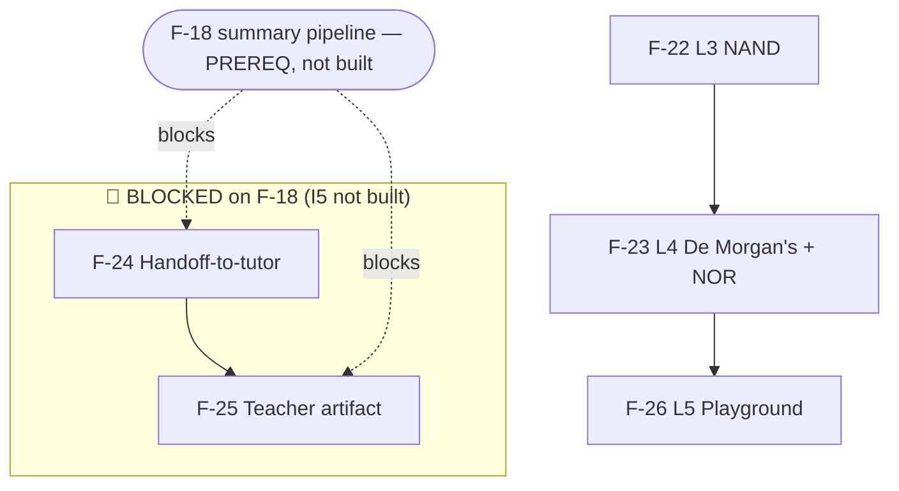

# BUILD-PLAN — I6 (Stretch: L3 NAND · L4 De Morgan's · Handoff-to-tutor · Teacher artifact · L5 Playground)

**Iteration slug:** `i6-stretch` · **Status:** Awaiting human approval (decisions D-A / D-B locked 2026-05-29) · **Date:** 2026-05-29 · **Planner:** kmaz-plan-iteration
(11 planning agents: F-22/F-23/F-25 one-opus-pass through architect/reuse/contrarian lenses; F-24/F-26 escalated to a 3-draft panel + synthesis. Every load-bearing claim verified against code under `apps/`, `packages/`, `lessons/`, `seed_data/`, `ops/` on 2026-05-29.)

**Scope:** the final stretch iteration ([ROADMAP I6](./ROADMAP.md#i6--stretch-priority-ordered-may-be-cut)), priority-ordered per [ADR-012](./adrs/ADR-012-stretch-features-for-nerdy.md): **L3 → L4 → Handoff → Teacher → L5 Playground.** "Cut decisively before sacrificing MVP polish."

- **F-22** Lesson 3 — NAND universality. New `lessons/3/`, NAND as a real booleans primitive (D-A), first-class web NAND gate, XOR-from-NAND pulse demo.
- **F-23** Lesson 4 — De Morgan's + halfway-misconception. New `lessons/4/`, NOR primitive, Polymath's first (semantic, not regex) misconception detector via `propose_hint`.
- **F-24** Handoff-to-tutor artifact. `packages/graph/handoff/` questions node + `GET /api/session/:id/handoff[/:token]` + `/handoff/:sessionId` route; **PDF via browser print, not Puppeteer.** **🚫 blocked on F-18.**
- **F-25** Teacher artifact (VT4S shape). `/teacher/:sessionId` re-framing F-18's report JSON; operator-token-gated. **🚫 blocked on F-18.**
- **F-26** L5 Playground (capstone). New `PlaygroundCanvas` ComponentSpec + sibling micro-statechart (ADR-013) + lockstep `verify_playground_equivalence` move; runs strictly last.

Build branch `build/i6-stretch`; worktrees under `.claude/worktrees/i6-stretch/`; convergence report `CONVERGENCE-i6-stretch.md`.

---

> **Headline findings — where the specs underplay reality (the build must heed these):**
>
> 1. **🚫 F-24 and F-25 are DAG-BLOCKED on F-18, which is NOT built.** VERIFIED: no `packages/graph/src/summary/`, no `SessionSummarySchema`/`getSessionSummary`, no `GET /api/session/:id/report`, no `apps/web/src/views/`. I5 (F-18..F-21) is planned-but-not-built. **Per Keith's decision (2026-05-29): plan all five, but the build leaves F-24/F-25 OUT until F-18/I5 lands.** Their plans assume F-18's frozen `SessionSummary` shape and confine all F-18 coupling to a single adapter (`apps/agent/src/handoff/buildArtifact.ts`) so the post-F-18 reconcile is a one-file change.
> 2. **The booleans grammar is AND/OR/NOT ONLY — XOR is composition, there is no NAND/NOR/XOR/XNOR token today.** The specs imply NAND/NOR "are added to booleans"; F-22's planner *contrarily* argued NAND could be desugared in the web layer alone. **Keith resolved this (D-A): add BOTH NAND and NOR as real additive primitive tokens** — consistent treatment, and it forces the F-22→F-23 serial order (same `packages/booleans/src/index.ts` parser regions).
> 3. **The contract `Gate` enum ALREADY lists `NAND`/`NOR`/`XOR`/`XNOR`** (`packages/contract/src/component.ts`). So no `ComponentSpec` change is needed for gates — only the booleans parser and the web `circuitModel.GateKind` (which *is* AND/OR/NOT-only) widen.
> 4. **The lesson-advance reflex is fully generic** (`masteryCelebrationAction`: `candidateNext = lessonId+1`, fail-closed on `loadLessonIfExists`; `handleAdvanceLessonTurn` requires `currentLessonId+1` + a real load). **F-22/F-23 need ZERO agent/server code** — pure data + booleans + web-circuit work.
> 5. **F-22's "misconception flags" cross-feature data gap (F-25 AC#3).** F-23 surfaces the halfway-misconception only inline in hint copy and persists nothing queryable; `SessionSummary` has no misconception field. F-25 either client-derives a best-effort flag or renders "none detected" — **never fabricates it** (D25-1).
> 6. **The playground's real DoS gap (F-26).** `scoreEquivalence` caps only the *submission* side, never the canonical — but in the playground the target IS the learner-authored canonical. A 26-var typed target → 2^26 enumeration (hung browser or event loop). The new `playgroundEquivalence` helper must cap **both** sides, on the client AND the server recompute (D26-2).
> 7. **F-26 resolves ARCHITECTURE Open Question 5 → a NEW ADR-013** (playground = sibling micro-statechart, NOT a spine substate; the locked phase shape is untouched).
> 8. **Puppeteer is the wrong PDF path for F-24.** The agent image is `node:22-alpine` with a curated COPY set, and agent/web are *separate containers* (`ops/polymath.caddyfile`) — a server-side Chromium render is a ~300MB + health-check-rollback + cross-container trap. **Chosen: `@media print` + `window.print()`** (zero new infra; the page already renders).

---

## Cross-cutting decisions (RESOLVED by Keith, 2026-05-29)

| # | Decision | Resolution | Affects |
|---|----------|------------|---------|
| **D-A** | Treatment of the locked `@polymath/booleans` grammar for NAND (F-22) and NOR (F-23). | **Add BOTH as real additive primitive infix tokens** (signatures unchanged; "the alphabet grows, the shapes don't"). Forces **F-22 → F-23 serial** (same parser regions). NAND first-class web gate; NOR mirrors it. | F-22, F-23, `packages/booleans`, `circuitModel.ts` |
| **D-B** | How to handle the F-18 block for F-24/F-25. | **Plan all five; the build leaves F-24/F-25 OUT until F-18/I5 merges.** Plans assume F-18's frozen `SessionSummary`; coupling confined to one adapter file. | F-24, F-25, DAG |

### Per-feature decisions carried into the build (recommended defaults; flagged where they deviate from spec text)

- **D22-1** L3 KC names `["nand-universality","nand-construction"]` — must match seeded L3 transfer-row `kc` fields (verify). · **D22-2** first-class NAND gate node (2 ports), not chained AND+NOT.
- **D23-1** misconception matched **semantically** (truth-table), never regex — load-bearing for zero false positives; reuse `propose_hint` (no menu lockstep). · **D23-2** leave the pseudocode grammar untouched (author L4 pseudocode without NOR). · **D23-3** keep L4 circuit items on AND/OR/NOT unless NOR is genuinely needed. · **D23-4** named hint at level L1.
- **D24-1** PDF via `@media print` + `window.print()` (Puppeteer rejected). · **D24-3** share token = nullable `sessions.share_token` random column, exempt from operator-auth (per-request-random-token pattern). · **D24-4** questions node in `packages/graph/src/handoff/`. · **D24-5** deterministic templates always-on, LLM rephrase optional/fail-soft.
- **D25-1** misconception flag: client-derive or "none detected" (don't fabricate; contract-extension is the principled follow-up). · **D25-2** reuse `POLYMATH_OPERATOR_SECRET`. · **D25-3** ⚠ token via `Authorization` header, NOT the `?token=` the spec's AC#1 shows (query params leak in logs) — **deviation from spec, approved**.
- **D26-1** playground = sibling micro-statechart + ADR-013 (substate rejected). · **D26-2** `playgroundEquivalence` caps BOTH target and submissions (the real DoS gap). · **D26-3** agent scaffold-only; LLM never the verdict authority; verdict client-side. · **D26-4** no `lessons/5/` dir; entry via `enter_playground` event.

---

## Frozen shared-contract signatures (the build must not reshape these)

All I6 contract changes are **ADDITIVE**. The append-only WS/Action discipline and the locked booleans signatures (`parse/evaluate/variables/truthTable/equivalent`) hold.

### `@polymath/booleans` — additive primitives (D-A) · owners F-22 (NAND) then F-23 (NOR)
```ts
// packages/booleans/src/index.ts — ADDITIVE only; locked signatures unchanged.
type Token = … | { type: 'nand' } | { type: 'nor' };
const KEYWORDS = { …, NAND: 'nand', NOR: 'nor' };
export type Ast = … | { kind: 'nand'; left: Ast; right: Ast }
                    | { kind: 'nor';  left: Ast; right: Ast };
// NAND at AND-precedence, NOR at OR-precedence; evaluate: !(l&&r) / !(l||r); astToExpression: "A NAND B" / "A NOR B".
// NEW export (F-26): playgroundEquivalence(target, submissions) — caps BOTH sides (distinct-variable cap).
```

### Web circuit model — additive `GateKind` · owner F-22 (NAND), F-23 (NOR, if used)
```ts
// apps/web/src/canvas/circuitModel.ts — web-internal type, NOT the cross-package contract.
export type GateKind = 'AND' | 'OR' | 'NOT' | 'NAND' /* F-22 */ | 'NOR' /* F-23, if an L4 circuit item allows it */;
```

### `ComponentSpec` — new `PlaygroundCanvas` variant (D-A unaffected) · owner F-26
```ts
// packages/contract/src/component.ts — ADDITIVE: union member + COMPONENT_KINDS + registry.tsx case (never default enforces).
z.object({ kind: z.literal('PlaygroundCanvas'), visibleReps: z.array(Rep) })  // no claimedTruthTable
// 'PlaygroundCanvas' appended to COMPONENT_KINDS.
```

### `ClientEvent` (WS) — append-only new kinds · owner F-26
```ts
// packages/contract/src/wire.ts — append-only.
{ kind: 'enter_playground', sessionId }
{ kind: 'playground_submit', sessionId, targetExpression: string<=MAX_EXPRESSION_LEN,
  submissions: { truth_table?: RepSubmission, circuit?: RepSubmission, pseudocode?: RepSubmission } }
{ kind: 'playground_request_scaffold', sessionId, targetExpression, learnerQuestion? }
{ kind: 'exit_playground', sessionId }
```

### Agent menu — lockstep new move · owner F-26
```ts
// apps/agent/src/agent/menu.ts + openaiClient.ts — LOCKSTEP additive (both halves or typecheck fails).
| { move: 'verify_playground_equivalence'; scaffold?: string; rationale: string }   // scaffold-only; never a mastery transition
export const F26_MENU = [ ...<then-current menu const>, 'verify_playground_equivalence' ] as const;
```

### New `HandoffArtifact` contract (additive new file) · owner F-24 (blocked on F-18)
```ts
// packages/contract/src/handoff.ts
TutorQuestionSchema = z.object({ kc: z.string(), question: z.string().min(1) });
HandoffArtifactSchema = z.object({
  sessionId: z.string().uuid(), generatedAt: z.string(), warmIntro: z.string(),
  summary: SessionSummarySchema /* OWNED BY F-18 — import, never redefine */,
  masteredKcs: z.array(z.string()), stuckKcs: z.array(z.string()),
  tutorQuestions: z.array(TutorQuestionSchema).min(3).max(5), nerdyFooter: z.string(),
});
// DB additive nullable: sessions.share_token text UNIQUE  (followup_token precedent)
```

### New lesson-adjacent file (not in `@polymath/contract`) · owner F-23
```ts
// lessons/4/misconceptions.json — validated by a small Zod schema in apps/agent:
{ items: { itemId: string; halfwayTruthTable: (0|1)[]; hintBody: string }[] }
```

### Untouched / explicitly NOT reshaped
`PhaseName` · `LESSON_PHASES` · `packages/statechart/src/lesson.ts` (F-26 uses a *sibling* machine) · the `Action` wire union · `@polymath/booleans` locked signatures · the contract `Gate` enum (already wide) · `lessonConfig.ts` schemas (new `lessons/3,4` are instances) · `HintCard.level` (F-23 reuses `propose_hint`).

---

## Build DAG



**Buildable now (lesson chain):** `F-22 → F-23 → F-26`, strictly serial.
- F-22 and F-23 share `packages/booleans/src/index.ts` (NAND vs NOR parser regions), `apps/agent/src/agent/stubClient.ts`, and possibly `circuitModel.ts` → **must serialize, F-22 first** (D-A). F-23 rebases on F-22.
- F-26 rebases on top of F-23 (needs the full NAND/NOR vocabulary + the circuit rendering) and on every other I6 contract edit (it touches `component.ts`/`wire.ts`/`menu.ts`/`server.ts`).

**Blocked (artifact chain):** `F-24 → F-25`, both gated on **F-18**. Merge order once unblocked: **F-18 → F-24 → F-25.** (F-25's default path needs only F-18's `/report` endpoint, so if F-24 slips F-25 can still build against F-18 alone.)

**Concurrency:** the roadmap's L3‖Handoff and L4‖Teacher pairs are *not* available this run because the Handoff/Teacher halves are F-18-blocked. So I6 builds as a **single serial lesson chain F-22→F-23→F-26**, with F-24/F-25 held until F-18 lands.

### Shared-file collision matrix (for the integration/rebase step)

| File | F-22 | F-23 | F-24 | F-25 | F-26 | Resolution |
|------|:--:|:--:|:--:|:--:|:--:|-----------|
| `packages/booleans/src/index.ts` | ✎ NAND | ✎ NOR | | | | serialize F-22→F-23 |
| `apps/web/src/canvas/circuitModel.ts` | ✎ | ✎? | | | (reads) | serialize F-22→F-23 |
| `apps/agent/src/agent/stubClient.ts` | ✎ | ✎ | | | | append-only, F-22 first |
| `packages/contract/src/component.ts` / `wire.ts` | | | | | ✎ | F-26 last; F-24/F-25 don't add ComponentSpec |
| `apps/web/src/components/registry.tsx` | | | | | ✎ | F-26 only (regular routes elsewhere) |
| `apps/agent/src/agent/menu.ts` / `openaiClient.ts` | | | | | ✎ | F-26 chains `F26_MENU` off the then-current const |
| `apps/agent/src/server.ts` | | | ✎ route | | ✎ playground | append-only route/handler blocks |
| `apps/web/src/main.tsx` | | | ✎ route | ✎ route | | append to router array (also F-18) — trivial |
| `apps/web/src/App.tsx` | | | ✎ button | | ✎ playground | append-only chrome edits |
| `packages/contract/src/index.ts` | | | ✎ | | | append-only export (also F-18/F-25) |
| `packages/graph/src/index.ts` | | | ✎ | | | append-only export (also F-18) |
| `apps/agent/src/db/schema.ts` (+migration) | | | ✎ share_token | (D25-1b only) | | sequence migration numbers |

---

## Model-tier map

| Feature | Build tier | Justification |
|---------|-----------|---------------|
| **F-22** | **Opus** lead + Sonnet for data | Locked-package edit (NAND token) + circuit-model logic (the pulse/AST is the truth-maker) → Opus; `lessons/3/*.json` authoring + eval fixtures → Sonnet. |
| **F-23** | **Opus** | Novel integrity-adjacent misconception detector (subtle false-positive mode + DoS cap) + locked-package edit (NOR). Lesson-data authoring splittable to Sonnet. |
| **F-24** | **Opus** coord + Sonnet leaves | Contract + auth boundary + first questions-generation node + F-18 adapter → Opus; the view + print CSS + wiring → Sonnet. *(Build only after F-18.)* |
| **F-25** | **Sonnet** (Opus if D25-1b) | Thin presentation mirroring F-18's `SessionReport.tsx`; auth is a copied pattern. Escalate to Opus only if the contract-extension misconception path is approved. *(Build only after F-18.)* |
| **F-26** | **Opus** (do not split) | New `ComponentSpec` variant + 4 append-only events + lockstep menu move + new sibling statechart + new ADR + DoS-sensitive equivalence — contract-touching and novel throughout. |

---

## Iteration-wide invariants the build must honor (from CLAUDE.md / ADRs)

- **Correctness stays client-side, off the network** — the playground verdict is a <5ms `playgroundEquivalence` call in the browser; the LLM is never the verdict authority (D26-3).
- **Every server-side `equivalent()`/`truthTable()` over learner input needs the distinct-variable cap** — F-23's detector and F-26's `playgroundEquivalence` (both sides) are the new call sites; over-cap = "incorrect"/"no-match", never enumerate.
- **Fail closed** — F-26 entry re-derives L4 mastery (earned-it) and fails closed; missing `misconceptions.json` (F-23) degrades to `rephrase`, never crashes boot; F-24's share token fails closed on absent/invalid.
- **Scope integrity reads to `events.app IS NULL`** — F-24's session read and F-26's mastery re-derive + verdict persistence must all carry the D3 app-discriminator filter.
- **Lockstep menu** — F-26's `verify_playground_equivalence` must land in BOTH `menu.ts` and `openaiClient.ts` (a missed half is a typecheck error).
- **Append-only WS/Action** — all new `ClientEvent` kinds are additive; no existing payload is reshaped.
- **MR pipelines stay offline-only** — F-23/F-24's LLM-judge/rephrase ≥-threshold evals run only in protected/manual jobs; the offline (preconditions/labels/templates) half gates MRs.
- **Docker COPY** — F-22/F-23 touch only already-COPYed dirs (`lessons/`, `seed_data/`, `packages/*`); F-24/F-26 add source to existing packages; **no Dockerfile change expected** — confirm with a `docker build` only if F-24's optional `pdfkit` (D24-2) is ever adopted.

---

## What "done" looks like for this iteration

The buildable chain (F-22 → F-23 → F-26) ships L3, L4, and the L5 playground, completing the full Boolean curriculum + the capstone — the demo arc lands on the XOR-from-NAND pulse (F-22 AC#5) and the free-build playground (F-26). The booleans grammar grows by two primitives (NAND, NOR) with locked signatures intact; one new `ComponentSpec` variant, one new sibling statechart (ADR-013), one new lockstep agent move. **F-24/F-25 (the Nerdy-specific handoff + teacher artifacts) are fully planned and held at the DAG until F-18/I5 lands** — they are the highest-leverage company-fit pieces and should be the first thing built once the summary pipeline exists.

> **Per ADR-012's cut rule:** if the remaining time can't finish F-26, cut it (it's the "often cut" capstone) rather than ship it half-built — F-22 + F-23 alone still complete the curriculum and are a coherent merge.
