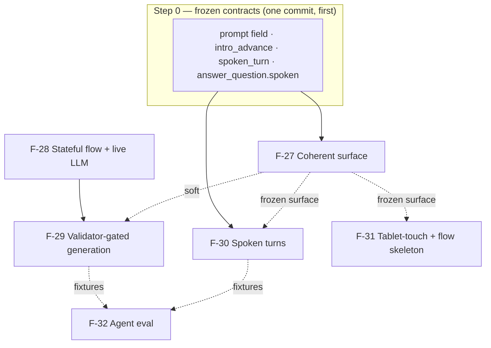

# BUILD-PLAN — I7 (Coherent surface + generative agent: F-27 surface · F-28 stateful flow + live LLM · F-29 validator-gated generation · F-30 spoken turns · F-31 tablet-touch + flow skeleton · F-32 agent eval)

**Iteration slug:** `i7-coherent-surface` · **Status:** Built — MR open (kmaz-build-iteration, 2026-05-31). All 6 features (F-27…F-32) built, reviewed (Opus, 6 dimensions), gating fixes applied, assembled linearly onto `build/i7-coherent-surface`; assembled suite green (non-agent 7 projects; agent 593 pass / 4 key-gated skips, isolated; typecheck + build clean). Originally **Approved** (Keith, 2026-05-31 — cleared for build launch; D1 locked to the new `intro_advance` event; D2–D14 build to the recommended resolutions in the table). · **Date:** 2026-05-31 · **Planner/Builder:** kmaz-plan-iteration → kmaz-build-iteration
(8 planning agents: F-27 + F-28 escalated to a 3-draft panel + synthesis; F-29/F-30/F-31/F-32 one opus pass through architect/reuse/contrarian lenses. Every load-bearing claim verified against code under `apps/`, `packages/`, `lessons/`, `evals/`, `.gitlab-ci.yml` on 2026-05-31.)

**Scope:** the post-MVP re-architecture ([ROADMAP I7](./ROADMAP.md#i7--coherent-surface--generative-agent-post-mvp-re-architecture)), governed by **[ADR-014](./adrs/ADR-014-validator-gated-generative-agent.md)** (agent generates within rails; engine owns the key), **[ADR-015](./adrs/ADR-015-coherent-learning-surface-transcript.md)** (anchored workspace + append-only transcript + flow skeleton + prompt-on-every-challenge), **[ADR-016](./adrs/ADR-016-spoken-turns-and-tablet-touch.md)** (spoken turns server-captured + tablet-first touch), **[ADR-017](./adrs/ADR-017-agent-eval-policy-golden-set.md)** (golden set + labeled banks).

- **F-27** Coherent learning surface — `apps/web` re-architecture (anchored workspace + append-only transcript), 2 append-only contract additions (`prompt` field, `intro_advance` kind). Ships **first, alone**; lands the transcript model F-30/F-31 sit in. **Opus.**
- **F-28** Stateful agent flow + live LLM — single-node graph → 5-node `StateGraph`; per-session deliberation memory; **closes the production wiring gap** (`index.ts` hardcodes the heuristic — `OpenAIMoveProvider` is wired NOWHERE today). The `realize` node is F-29's seam. **Sonnet** + Opus review.
- **F-29** Validator-gated generation — fills F-28's `realize`; engine owns the key; Layer-2 unchanged. **🔗 HARD-deps F-28.** **Opus** (safety core).
- **F-30** Spoken-turn tutoring — server-captured general-utterance seam (sibling of explain-back) routed through `learner_question`. **Sonnet.**
- **F-31** Tablet-touch + flow skeleton — 44px touch contract + a phase-reading sidebar rail. **Sonnet.**
- **F-32** Agent eval — golden set (offline 100%, gates MRs) + live banks (protected-main); fixes the never-run inner-agent live gate. Lands **first/independently**. **Sonnet.**

Build branch `build/i7-coherent-surface`; worktrees under `.claude/worktrees/i7-coherent-surface/`; convergence report `CONVERGENCE-i7-coherent-surface.md`.

---

> **Headline findings — where the specs underplay reality (the build must heed these):**
>
> 1. **🚨 F-28 closes a real production wiring gap, NOT behavior-preserving polish.** VERIFIED: `apps/agent/src/index.ts:44` hardcodes `createServer({ … agent: new StubAgentClient() … })` (heuristic-only). `new OpenAIMoveProvider(…)` is constructed in **no** production code — only in `eval.test.ts`. `FlowAgentClient`'s doc comment *claims* "Production passes `OpenAIMoveProvider`" — **that is false today.** So F-28 AC#4 ("with `OPENAI_API_KEY` set, Ask the tutor returns a real answer") is **literally unsatisfiable** until F-28 adds a `makeAgentClient()` factory + wires `index.ts:44`. (D2)
> 2. **🚨 F-32 fixes a never-run live eval.** VERIFIED: the inner-agent live ≥95% gate (`eval.test.ts`'s `liveIt`) runs only inside `agent_test`, which gets **no `OPENAI_API_KEY` even on `main` push** — so it has **always self-skipped.** F-32's new `agent_live_eval` job is the first place it (and the new generation/spoken live banks) ever fires live. (D13)
> 3. **Two features append to the `ClientEvent` wire union** — F-27 (`intro_advance`) and F-30 (`spoken_turn`). Both additive, no payload reshaped; the only convergence is **rebase order** on `wire.ts` (the discriminated-union arms don't conflict). F-30 also adds optional `spoken` to the `answer_question` Action. (D1/D9)
> 4. **The `prompt` field is the cross-feature convergence point.** F-27 introduces optional `prompt` on 4 item `ComponentSpec` kinds; F-27's renderer treats a prompt-less item as a visible error; F-29 supplies prompts on generated items; the heuristic/authored path needs a prompt **backfill** so the keyless demo (which ships first and gets the live drive) doesn't show error placeholders everywhere. (D4)
> 5. **The touch contract is ~80% already met.** VERIFIED: `.btn` already declares `min-height: 2.75rem /* 44px */`; truth-table cells are already 44×44. The real gaps are narrow: no `min-width`; the react-flow `.react-flow__handle` wire dots are ~6–8px (finger-impossible); the literal "44px" is scattered and will drift. `@xyflow/react ^12` already drags via pointer events — the work is **CSS + `touch-action`, not a config flag.** (D11)
> 6. **The phase exposure is narrowed to 3 of 7 today.** VERIFIED: `App.tsx`'s `currentPhase()` collapses the XState snapshot to `introducing|practicing|transferring`. The F-31 flow rail needs the full `PhaseName` (to show `hint`/`assessed`/`mastered`/`remediating`) — a **view-only widening** that stops discarding state App already holds in `snapshot.value`. **F-27 and F-31 must agree who lifts the full enum** into the reserved rail seam. (D7)
> 7. **No new `ComponentSpec` kind anywhere in I7.** Every feature renders/targets the existing 14 kinds. The registry's coordinated three-place change protocol is **not** triggered. The only contract growth is two append-only optional wire kinds + one optional `prompt` field + one optional `spoken` field. (D14)
> 8. **The integrity seam pattern is reused verbatim, not invented.** F-30's general-utterance seam is a copy of the `ExplainBackCaptureRegistry`; the CLAUDE.md "verify the legitimate path actually fills the seam" lesson is a first-class test (a fail-closed input nothing fills is a gate nobody can pass).

---

## Cross-cutting decisions (RESOLVED — Keith approved 2026-05-31)

> **D1 is LOCKED to "new `intro_advance` event."** D2–D14 are approved at their **recommended resolutions** below (Keith: "you've made some good decisions, I trust them" — the plan is approved as drafted). The build follows the Recommended-resolution column.


| # | Decision | Recommended resolution | Affects |
|---|----------|------------------------|---------|
| **D1** | `intro_advance` mechanism (F-27). | **New append-only optional `ClientEvent` kind** (not a `session_start` re-emit). ADR-015 §2 effectively requires a distinct signal. | F-27, `wire.ts`, both agent providers (lockstep) |
| **D2** | The F-28 production wiring gap (`index.ts:44` heuristic-only; `OpenAIMoveProvider` wired nowhere). | **Fix in F-28 scope** via a `makeAgentClient()` self-gating factory (mirrors `makeExplainBackJudge`). AC#4 is unsatisfiable without it. | F-28, `index.ts`, AC#4 |
| **D3** | Deliberation-memory store (F-28). | **In-process `Map<sessionId, DeliberationMemory>` on `FlowAgentClient`, size-capped.** It's a cache (lost on restart is fine; BKT/streak/gates are the durable fold). Persisting tempts a future reader to trust it as integrity — AC#3 forbids. | F-28 |
| **D4** | Prompt-backfill scope (F-27). | **Backfill the keyless path in F-27** (`lessons/*/content.json` items + the heuristic item→spec compile) so the keyless demo never trips AC#7's error placeholder. F-29 owns generated prompts. | F-27, F-29, `lessons/*` |
| **D5** | Inline verdict — keep or single-source (F-27). | **Keep the in-component inline verdict AND add the transcript verdict turn** (lower-risk). Single-sourcing is a larger per-rep touch. | F-27 |
| **D6** | F-27 live-drive wiring (Playwright can't intercept the agent WS). | **Real Docker stack on :8080** (chrome-devtools MCP or Playwright pointed at :8080, NOT vite :5173 which has no agent). | F-27 verification |
| **D7** | Who widens phase exposure 3→7 — F-27 or F-31. | **F-27 lifts the full `PhaseName` into the reserved rail seam**; F-31 consumes it. (If F-27 keeps the 3-narrow, F-31 owns the widening.) Decide so the App.tsx edit has one owner. | F-27, F-31 |
| **D8** | Flow-skeleton display model (F-31). | **Curated mainline + branches** (`introducing → practicing → assessed → mastered`, with `hint`/`transferring`/`remediating` as branch markers), NOT a flat 7-list / `progressbar`. Matches AC#4 + ADR-015's non-linear thesis. "Completed" = furthest-mainline-phase reached (monotonic). | F-31 |
| **D9** | How the learner's spoken turn reaches the web transcript (F-30). | **Append-only optional `spoken: true` on the `answer_question` Action** (no new `ServerMessage`; `actionAdapter` already surfaces question+answer). F-27 renders `spoken` as a learner bubble; fail-safe default = typed. | F-30, F-27, `action.ts` |
| **D10** | Spoken-turn trigger kind (F-30). | **New append-only `ClientEvent` `spoken_turn { sessionId }`, NO transcript field.** Reusing `learner_question` is unsafe (its required `question` string is the forbidden client-trusted path). | F-30, `wire.ts` |
| **D11** | F-29 generation: new move vs reuse item path. | **Reuse `next_practice_item`/etc. with the engine overwriting the key** (ADR-014 §1: "exactly an authored item"). No new `TacticalMove`, no menu/enum lockstep churn. | F-29 |
| **D12** | F-29 rails alphabet source. | **Content-derived** (operators in authored `targetExpression`s, union over lessons ≤ id) — no contract edit. Alternative: a new optional `LessonContent.allowedOperators` field. | F-29 |
| **D13** | F-32 `agent_live_eval` job: deploy gate + first-run safety. | **Add the protected-main job** (the inner-agent live gate has never run). Consider shipping it `allow_failure` initially (the provider may have drifted and red main on first run); add to `deploy.needs:` once green. | F-32, `.gitlab-ci.yml` |
| **D14** | `OpenAISpokenGroundednessJudge` ownership (F-30 vs F-32). | **F-32 owns the judge + bank + threshold**; F-30 contributes the labeled utterance/answer fixtures. | F-30, F-32 |

---

## Frozen shared-contract signatures (the build must not reshape these)

All I7 contract changes are **ADDITIVE** (append-only WS/Action; no payload reshaped; **no new `ComponentSpec` kind**; `COMPONENT_KINDS` unchanged; the booleans + statechart signatures locked). The reconciled wire/contract surface across all six features:

### `@polymath/contract` — append-only additions (the ONLY cross-package contract edits)
```ts
// packages/contract/src/component.ts — ADD optional `prompt` to the four item kinds (F-27; F-29 supplies it).
//   TruthTablePractice, CircuitBuilder, PseudocodeChallenge, TransferProbe each gain:
prompt: z.string().max(2000).optional(),
//   Optional on the wire (existing senders validate); REQUIRED at the surface boundary
//   (F-27 renderer treats a prompt-less item as a visible error, never bare).

// packages/contract/src/wire.ts — ClientEvent union gains TWO append-only optional kinds.
//   ⚠ Rebase convergence: F-27 + F-30 both append arms (additive, no conflict). Order: land F-27's first.
z.object({ kind: z.literal('intro_advance'), sessionId: SessionId }),                       // F-27 / D1
z.object({ kind: z.literal('spoken_turn'),  sessionId: SessionId }),                         // F-30 / D10 — NO transcript field

// packages/contract/src/action.ts — answer_question variant gains ONE append-only optional field.
spoken: z.boolean().optional(),   // F-30 / D9 — "this question was a captured spoken turn"
```
**Untouched in `@polymath/contract`:** every existing payload, the `Action` discriminator set, `ComponentSpec` kinds + `COMPONENT_KINDS`, `PhaseName`, `RepSubmission`, `submit`'s fields. The contract package has **no 100% coverage gate** (unlike booleans), but land tests for the new arms in the same commit.

### Agent-internal types (NOT `@polymath/contract` — no contract-change protocol)
```ts
// apps/agent/src/agent/deliberation.ts (F-28, NEW)
export type LearnerProgress = 'stuck' | 'progressing' | 'guessing' | 'over_hinting' | 'ready';
export type PedagogicalIntent = 'introduce' | 'practice' | 'simplify' | 'rephrase' | 'hint' | 'answer' | 'probe_transfer' | 'propose_mastery' | 'wait';
export interface DeliberationMemory { lastIntent?: PedagogicalIntent; lastDifficultyTier?: number; regenerationCount: number; lastClassification?: LearnerProgress; turnCount: number; }
export interface DeliberationContext { classification: LearnerProgress; intent: PedagogicalIntent; memory: DeliberationMemory; }

// apps/agent/src/agent/client.ts (F-28) — MoveProvider widens via an OPTIONAL 3rd param (every existing provider compiles unchanged):
proposeMove(input: AgentInput, validationError?: string, deliberation?: DeliberationContext): Promise<TacticalMove>;

// apps/agent/src/agent/makeAgentClient.ts (F-28, NEW) — the wiring-gap fix:
export function makeAgentClient(): AgentClient;  // OPENAI_API_KEY ? FlowAgentClient(OpenAIMoveProvider) : StubAgentClient

// apps/agent/src/agent/menu.ts (F-29) — ProposedItem gains `prompt?` (agent-internal); lockstep with openaiClient ItemSchema.prompt.
// apps/agent/src/agent/key.ts (F-29, NEW) — computeItemKey(expression): {ok:true; table:(0|1)[]} | {ok:false; detail} — VAR-CAPPED.
// apps/agent/src/agent/rails.ts (F-29, NEW) — allowedOperatorAlphabet / lessonMaxVars / checkGeneratedItem(item, input).
```

### Voice capture seam (F-30) — a getter beside the explain-back registry; `RealtimeSession` UNCHANGED
```ts
// apps/agent/src/voice/learnerUtteranceRegistry.ts (NEW, copy of ExplainBackCaptureRegistry, sessionId-keyed):
class LearnerUtteranceRegistry { register(sessionId, session); setLatest(sessionId, transcript); latestFor(sessionId): string | undefined; }
// apps/agent/src/server.ts — ServerDeps gains (mirror of explainBackTranscriptFor):
learnerUtteranceRegistry?: LearnerUtteranceRegistry;
latestLearnerUtteranceFor?: (sessionId: string) => string | undefined;
// FrameOptions gains boundSessionId?: string (WS-binding rule); VoiceBridgeOpts gains onLearnerUtterance?(text).
```

### Web learning surface (F-27) — web-LOCAL types (never cross the wire); the F-30/F-31 seams
```ts
// apps/web — Turn discriminated union: intro | workedExample | hint | answer | recall | verdict | completedItem | spokenTurn
//   (spokenTurn{speaker,text} EXISTS now; F-30 produces it). appendTurn(turn) helper. Anchored `mounted` slot + transcript[].
//   Layout: two-column grid (workspace | transcript) + RESERVED left-rail slot + lifted phase/LESSON_PHASES for F-31.
```

### Touch + flow-skeleton (F-31) — a new cross-cutting UI contract (CSS/token, not a wire/type contract)
```css
/* tokens.css */ --touch-target-min: 2.75rem; /* 44px — WCAG 2.5.5 (ADR-016) */
/* global.css  */ .touch-target { min-height: var(--touch-target-min); min-width: var(--touch-target-min); }
/* circuit.css */ .react-flow__handle { width:14px; height:14px } + ::before { inset:-15px } /* 44px hit-slop */; touch-action:none on pane/nodes
```
```ts
// apps/web/src/components/FlowSkeleton.tsx (F-31, NEW) — VIEW-ONLY, reads the spine, never writes it:
export function FlowSkeleton(props: { phase: PhaseName; phases?: readonly PhaseName[] }): ReactElement;
// App.tsx currentPhase()/setPhase()/phase widened from the 3-narrow to the full PhaseName (D7) — view-only, no spine edit.
```

### Eval contract (F-32) — fixture format + the golden/live split
```ts
// evals/golden/{move,generation,prompt,spoken}.json — { note, fixtures: Fixture[] }; Fixture has id, bank, expectFail (meta-check).
// apps/agent/src/agent/eval/golden.test.ts (NEW) — offline 100% + meta-check + key-gated liveIt blocks.
// generation-validity reuses the SAME var-capped @polymath/booleans path as layer2.ts (single correctness source).
```

### Untouched / explicitly NOT reshaped
`@polymath/booleans` locked signatures (`parse/evaluate/variables/truthTable/equivalent`, `scoreEquivalence`, `playgroundEquivalence`) + its 100% coverage gate (F-29 helpers live in `apps/agent`, NOT booleans) · the `PhaseName` enum + `LESSON_PHASES` + `packages/statechart` spine (F-31 reads, never extends) · the `Action` discriminator set (only `answer_question` gains an optional field) · every `ComponentSpec` kind + `COMPONENT_KINDS` (no new kind) · `RealtimeSession` interface (F-30 adds a getter beside it) · Layer-2 (`validateLayer2`) byte-for-byte (F-29) · the `TacticalMove` union / `F26_MENU` / `toTacticalMove` (F-29 reuses the item path; F-28 redistributes — neither extends the menu) · the explain-back registry/preconditions/judge (F-30 is a sibling) · the 15s timeout + retry-once→fallback→`no_action` contract (F-28 redistributes inside `realize`, identical behavior).

---

## Build DAG



**Hard dependency (the only one):** `F-28 → F-29` (generation IS F-28's `realize` node) — serial.

**Soft dependencies (build against the FROZEN surface, not unshipped behavior):** F-27 ships first and freezes the transcript surface + reserved rail slot + the `phase` lift; F-30 (web producer side) and F-31 (rail mount + touch) build against that frozen surface. F-29 renders generated items into it. F-32 is the gate F-29/F-30 are "done" against, not a blocker on their start.

**Recommended build order / concurrency:**
1. **Step 0 (serial, first):** land the frozen contract additions (`prompt`, `intro_advance`, `spoken_turn`, `answer_question.spoken`) in one commit so every feature builds against a stable contract. (Owner: F-27 lands `prompt`+`intro_advance`; F-30 lands `spoken_turn`+`spoken` — or fold both into the Step-0 commit to remove the wire rebase.)
2. **Wave A (concurrent):** **F-27** (web surface), **F-28** (agent flow + wiring), **F-32** (eval harness — independent). Three different ownership zones (`apps/web` · `apps/agent/src/agent` graph · `evals/` + CI) — minimal overlap.
3. **Wave B (after deps):** **F-29** (after F-28's `realize` seam), **F-30** (after F-27's frozen surface), **F-31** (after F-27's frozen layout + phase lift). F-29 is agent-side; F-30/F-31 are mostly web-side against F-27 — low mutual overlap.
4. **F-29/F-30** append their eval fixtures into F-32's `evals/golden/{generation,spoken}.json` as they land (union on conflict).

### Shared-file collision matrix (for integration/rebase)

| File | F-27 | F-28 | F-29 | F-30 | F-31 | F-32 | Resolution |
|------|:--:|:--:|:--:|:--:|:--:|:--:|-----------|
| `packages/contract/src/wire.ts` | ✎ `intro_advance` | | | ✎ `spoken_turn` | | | append-only arms; land F-27 first, F-30 rebases |
| `packages/contract/src/component.ts` | ✎ `prompt`×4 | | (reads) | | | | F-27 owns; F-29 consumes |
| `packages/contract/src/action.ts` | | | | ✎ `spoken` | | | F-30 only (optional field) |
| `apps/web/src/App.tsx` | ✎✎ rearchitecture | | | ✎ producer | ✎✎ phase widen + rail mount | | **F-27 first**; F-30/F-31 build on the frozen seams (`appendTurn`, reserved slot, lifted phase) |
| `apps/web/src/components/registry.tsx` | ✎ prompt enforce | | (renders) | | | | F-27 only |
| `apps/web/src/components/{TruthTable,CircuitBuilder,Pseudocode}.tsx` | ✎ render prompt | | | | ✎ touch CSS-led | | different lines; coordinate (F-27 prompt, F-31 sizing) |
| `apps/web/src/styles/{tokens,global,circuit}.css` | (polish) | | | | ✎ touch contract | | F-31 owns touch tokens |
| `apps/web/playwright.config.ts` | (drive at :8080) | | | | ✎ tablet project | | F-31 adds the project |
| `apps/agent/src/agent/graph.ts` | | ✎✎ 5-node graph | ✎ realize body | | | | **F-28 first** (owns restructure); F-29 fills `realize` |
| `apps/agent/src/agent/menu.ts` / `openaiClient.ts` | ✎ intro_advance branch | (no menu change) | ✎ `prompt` lockstep | | | | F-27's provider branch + F-29's `ItemSchema.prompt`; lockstep both halves |
| `apps/agent/src/agent/stubClient.ts` | ✎ intro_advance branch | (StubAgentClient reused) | ✎ pickLessonItem prompt | | | | append-only branches |
| `apps/agent/src/index.ts` | | ✎ `makeAgentClient()` | | | | | F-28 only |
| `apps/agent/src/server.ts` | | | | ✎ seam inject + handler + bound id | | | F-30 only (additive, mirror explainBack inject) |
| `apps/agent/src/voice/*` | | | | ✎ new seam files | | | F-30 only (new files) |
| `apps/agent/src/agent/eval/*` | | (no edit) | ✎ generation fixtures | ✎ spoken fixtures | | ✎✎ owns harness | F-32 ships format+seeds; F-29/F-30 append (union on conflict) |
| `.gitlab-ci.yml` | | | | | | ✎ `agent_live_eval` job | F-32 only |
| `lessons/*/content.json` | ✎ prompt backfill (D4) | | | | | | F-27 (confirm not colliding with L3/L4 if re-touched) |

---

## Model-tier map

| Feature | Build tier | Justification |
|---------|-----------|---------------|
| **F-27** | **Opus** for App.tsx (transcript reducer, append-vs-re-anchor, contract freeze, layout seams); **Sonnet** for component prompt rendering, banner, tests | The transcript model + seams are the load-bearing structure F-30/F-31 inherit; subtle re-anchor/completed semantics. Live-drive interpretation is Opus/human-supervised (the prior jsdom-only gap). |
| **F-28** | **Sonnet** + one **Opus review** checkpoint | Redistribution + wiring; hard reasoning resolved in the plan. Opus reviews the keyless behavior-preservation golden proof + the wiring-gap fix (no key in MR pipelines). |
| **F-29** | **Opus** (do not split) | The iteration's safety core — engine-owns-key overwrite, var-capped new call site, "Layer-2-unchanged-but-wrong-key-is-an-overwrite" subtlety, adversarial reasoning as attacks. A weaker model writes a plausible-but-unsafe version. |
| **F-30** | **Sonnet** + standard Opus review | High-reuse (3 files are mechanical copies of the explain-back seam); the integrity boundary is fully specified by precedent → checklist, not open design. |
| **F-31** | **Sonnet** | Architecture resolved; mechanical CSS + one view component + Playwright specs. Escalate only if F-27 leaves no usable rail slot (D7). |
| **F-32** | **Sonnet** | Pattern-replication of two existing runners + a near-byte-for-byte CI clone. Escalate the single `agent_live_eval` YAML decision (D13) if it fights the shared workflow rules. |

---

## Iteration-wide invariants the build must honor (from CLAUDE.md / the ADRs)

- **Append-only wire / Action; NO new `ComponentSpec` kind.** Only additive optional fields (`prompt`, `spoken`) + two new optional `ClientEvent` kinds (`intro_advance`, `spoken_turn`). No existing payload reshaped; `COMPONENT_KINDS` unchanged.
- **The server never trusts the agent.** Layer-2 (`validateLayer2`) is **byte-for-byte unchanged** (F-29); the **engine owns the key** (the model's asserted `claimedTruthTable` is always overwritten by `computeItemKey`, every provider); earned-it gates (transfer probe, mastery) unchanged.
- **The server never trusts a client transcript.** Spoken Q&A (F-30) answers ONLY the server-captured utterance (`latestLearnerUtteranceFor`), never a client frame; fails closed to empty; and **the legitimate path must actually fill the seam** (the bridge feeds the registry) — a fail-closed input nothing fills is a gate nobody can pass.
- **Var-cap on EVERY `@polymath/booleans` call site**, including F-29's new `computeItemKey` (`MAX_DISTINCT_VARS=10`; over-cap → reject, never enumerate).
- **Server-derived integrity signals** (F-28 `assess` from the server snapshot only, never client flags); deliberation memory is **cache, never integrity** (AC#3); `events.app IS NULL` on every integrity read; server-recomputed correctness; uncapped off-topic counter (folds spoken off-topic too); server-minted mastery celebration.
- **The mastery gate fails closed.** Generation drives **practice only** — a generated streak cannot fast-path mastery, the transfer probe, or explain-back; the transfer bank stays hand-curated/read-only (probes are NOT generated).
- **The statechart spine is untouched.** The transcript is a view; the flow skeleton **reads** `LESSON_PHASES`/`PhaseName` (the 3→7 widening stops discarding state, it doesn't write the spine).
- **High-frequency interaction stays client-only.** The verdict renders from the existing `<5ms` client compute; correctness is **not** moved server-side.
- **Lockstep menu.** F-27's `intro_advance` provider branch lands in BOTH the heuristic and OpenAI providers; F-29's `ProposedItem.prompt` ↔ `ItemSchema.prompt` ↔ `itemSpec`/`compileMove` move together. F-29 adds **no** new `TacticalMove` (so `F26_MENU` is untouched — a deliberate non-change to confirm in review).
- **WS bound-session.** Any privileged/stateful WS-triggered action keys off the `session_start`-bound id (F-30 threads `boundSessionId` into `FrameOptions`), never a per-frame id.
- **No provider secret in MR pipelines.** F-28's `makeAgentClient` + F-32's live banks self-gate on env; the `agent_live_eval` job is `when:never` on `merge_request_event`; `verify`/`agent_test` stay keyless. The offline golden set (no key) gates MRs at 100%.
- **TTS-out stays explain-back-only.** The spoken-Q&A reply is **text** (`answer_question`) — the durable transcript turn.
- **Docker COPY.** No new workspace package and no new runtime-read data dir → **no `apps/agent/Dockerfile` change** (the new agent files live in already-COPYed `apps/agent`; `evals/` is CI/test-only and is NOT in the image). Confirm with a `docker build` only if any feature adds a boot-time-read file.
- **Web build artifact.** F-27's web work must `pnpm build` once and be driven against the real `vite build`/Docker artifact (the prior verification gap was composition, invisible to jsdom).
- **Agent suite isolation.** Gate DB-backed agent assertions on `pnpm --filter @polymath/agent test` run ALONE (the shared-`polymath-test-pg` flake); a flaky full `pnpm test` is not a gating failure.

---

## What "done" looks like for this iteration

I7 closes the five gaps the product owner named — the surface becomes a coherent anchored-workspace + append-only transcript with explicit verdicts, a forward affordance, an orientation banner and a flow skeleton (F-27/F-31); the agent becomes a real multi-node deliberation graph with a **live LLM actually wired in production for the first time** (F-28) that **generates** challenges within rails with the engine owning the key (F-29); the student's spoken turn becomes first-class server-captured tutoring input (F-30); and the agent is **evaluated, not just unit-tested**, with a golden set gating every MR and live banks on protected main — including the inner-agent live gate that **had never actually run** (F-32). Every I0–I6 invariant is preserved (append-only contract, untouched spine, server-never-trusts-agent/client, var-cap, fail-closed mastery, no new `ComponentSpec` kind). The demo arc gains a visible, oriented, generative, listening surface — the brief's "the interface itself is part of the tutoring."

> **Cut/sequencing note:** F-27 is the keystone — it ships first, alone, and is the only feature whose verification gate is a **live browser drive** (the prior jsdom-only miss). If time is short, F-27 + F-28 alone deliver the visible coherence + the live agent; F-29 (generation), F-30 (spoken), F-31 (touch/skeleton), F-32 (eval) layer on independently against the frozen F-27 surface and can be prioritized or trimmed without destabilizing the others.
