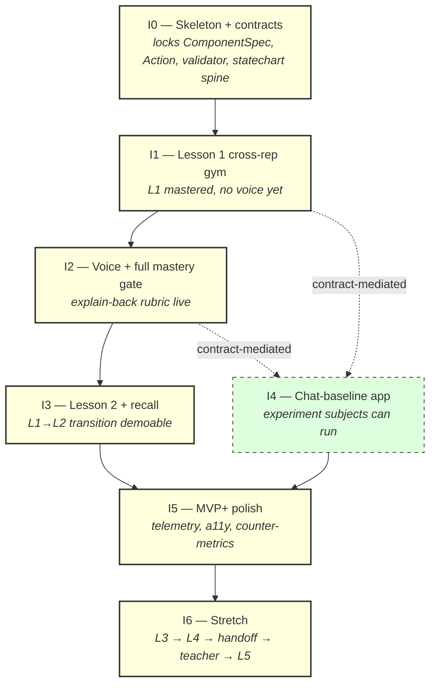
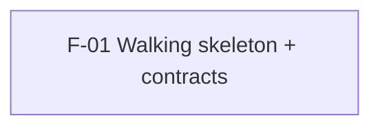
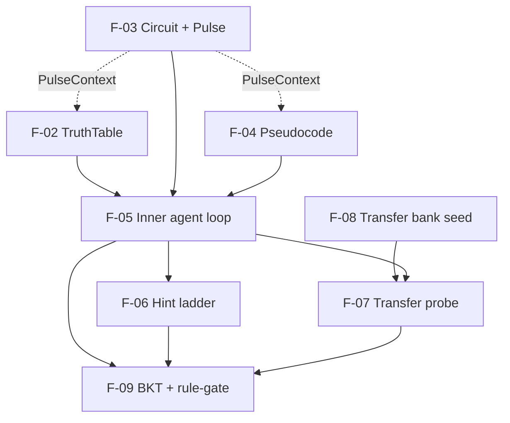
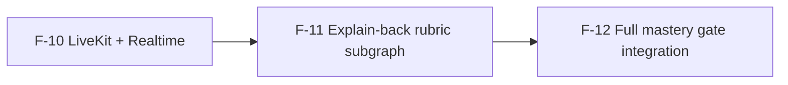
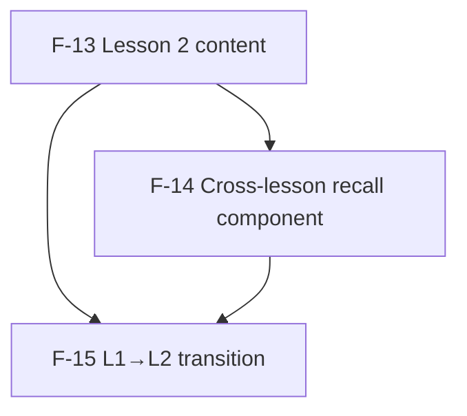
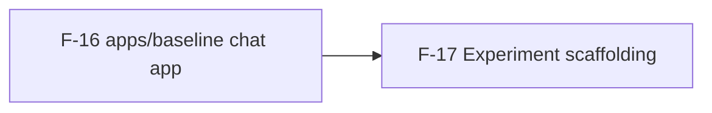
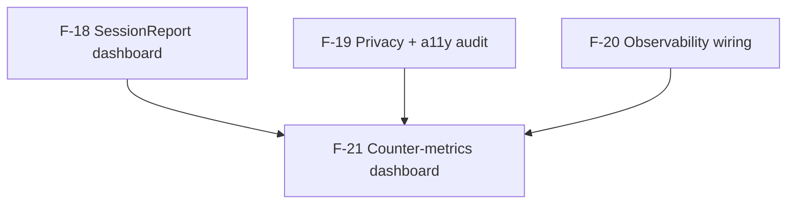
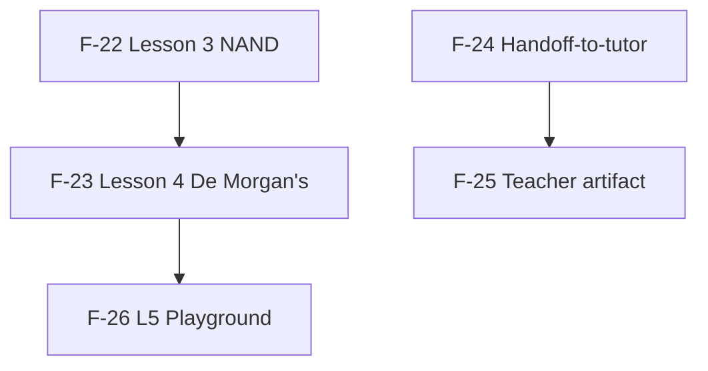

# Roadmap — Polymath

**Status:** draft · **Date:** 2026-05-27 · **Source:** [ARCHITECTURE.md](./ARCHITECTURE.md), [ADRs](./adrs/), [BRIEF](../BRIEF.md)

---

## Overview

Polymath is a multimodal hyperresponsive mastery interface for Boolean logic ([ADR-001](./adrs/ADR-001-learning-domain-boolean-logic.md)). This roadmap decomposes the architecture into **7 iterations** containing **26 vertical-slice features**, designed for a build cadence of **many Claude sessions each spinning up many sub-agents**, with agent teams running concurrent feature branches against tightly locked contracts. The arc runs from a walking-skeleton deploy (iteration 0), through MVP (L1+L2 with the full mastery gate and the chat-baseline experiment) by week 4, into stretch (L3 → L4 → tutor handoff → teacher artifact → L5 playground) by week 6. Two iteration pairs are designed for cross-iteration concurrency: I3 (Lesson 2) ‖ I4 (chat-baseline app), and the stretch features (I6) are independently shippable in priority order.

The iteration arc — what each merge buys, in order:

| # | Iteration | After this iteration, a learner / evaluator can… |
|---|-----------|----------------------------------------------------|
| 0 | Skeleton + contracts | …visit `polymath.biograph.dev`, see a Lesson 1 intro, submit a hardcoded answer through the WebSocket and see the round-trip work end-to-end. |
| 1 | Lesson 1 cross-rep gym (no voice) | …complete Lesson 1 across all three representations through to a rule-gated "mastered" state, with hints, transfer probe, BKT, and the inner agent live. |
| 2 | Voice + full mastery gate | …pass an explain-back voice rubric and have all four mastery conditions enforced; the anti-cheat thesis is observable. |
| 3 | Lesson 2 + cross-lesson recall | …complete L1→L2, including a visible cross-lesson recall moment in L2. |
| 4 | Chat-baseline experiment | …run the within-subject baseline experiment; pre/post tests + 24h follow-up are captured. (Runs concurrent with I3.) |
| 5 | MVP+ polish | …see Nerdy-KPI-shape telemetry, the privacy/accessibility posture, and all six counter-metrics on a dashboard. |
| 6 | Stretch (priority-ordered, may be cut) | …work through L3 → L4 → tutor handoff → teacher artifact → L5 playground, in that order, as time permits. |

The most consequential single decision in this roadmap: **contracts lock at the end of iteration 0** so iterations 1–6 can safely fan out across many sub-agent workstreams in parallel. Iteration 0 is therefore atypically slow and atypically critical; it converts wall-clock time into parallelism budget for everything that follows.

---

## Iteration DAG

**Hard dependencies** (solid arrows): the downstream iteration's features genuinely cannot start until the upstream iteration's behavior is merged.

**Contract-mediated dependencies** (dashed arrows): the downstream iteration may proceed in parallel against a *locked contract* (`packages/booleans` + the seeded `transfer_bank`), without waiting for the upstream iteration to fully ship. The chat-baseline app (I4) is the canonical example — it consumes the Boolean validator and the transfer bank, both of which are locked in I0/I1, so I4 can start as soon as I1's transfer-bank seed feature (F-08) merges, regardless of I2/I3 progress.

The longest-serial residue (the **critical path**): `I0 → I1 → I2 → I3 → I5`. Stretch (I6) sits past the critical path and can be cut without affecting MVP shippability. I4 runs concurrent with I2+I3 against locked contracts; it does not extend the critical path.

---

## Features index

| ID | Feature | Iteration | Before → After (one line) | Depends on | Unblocks | Parallel with |
|----|---------|-----------|----------------------------|-----------|----------|---------------|
| F-01 | [Walking skeleton + contracts](./features/01-walking-skeleton-and-contracts.md) | I0 | No site exists → polymath.biograph.dev serves the Lesson 1 intro and round-trips a `submit` event through the deployed agent | none | F-02..F-26 | none (serial) |
| F-02 | [TruthTable representation](./features/02-truth-table-representation.md) | I1 | No truth-table workspace → learner can toggle inputs on a truth table for any L1 target expression and get correctness feedback in <5ms | F-01 | F-05, F-07 | F-03, F-04 |
| F-03 | [Circuit representation + Pulse](./features/03-circuit-representation-and-pulse.md) | I1 | No circuit workspace → learner can drag gates, wire them, press "Test it", and watch the pulse propagate; submitted circuit checked vs. truth-table | F-01 | F-05, F-07 | F-02, F-04 |
| F-04 | [Pseudocode representation](./features/04-pseudocode-representation.md) | I1 | No pseudocode workspace → learner can write boolean pseudocode with syntax highlighting, submit it, get correctness feedback | F-01 | F-05, F-07 | F-02, F-03 |
| F-05 | [Inner agent + bounded action menu](./features/05-inner-agent-and-bounded-menu.md) | I1 | Agent service is a stub → agent proposes typed Actions (`next_item`, `rephrase`, `simpler_item`, `alt_representation`) on submit/hint events and the statechart mounts them | F-02, F-03, F-04 | F-06, F-07, F-09 | F-08 |
| F-06 | [Hint ladder (3 levels)](./features/06-hint-ladder.md) | I1 | No hints available → learner can request a hint and get L1 (templated), L2 (templated), or L3 (free-form) with hint usage logged for the gate | F-05 | F-09 | F-07, F-08 |
| F-07 | [Transfer probe + hidden-reps refusal](./features/07-transfer-probe.md) | I1 | No transfer assessment → learner sees a transfer probe in a held-out representation; attempting to bring hidden reps back is refused with stock copy | F-02, F-03, F-04, F-05, F-08 | F-09, F-12 | F-06 |
| F-08 | [Transfer bank seed (hand-curated, 32 items)](./features/08-transfer-bank-seed.md) | I1 | DB has no transfer items → `transfer_bank` table seeded with 32 hand-verified items (8 per lesson × 4 lessons) at deploy time | F-01 | F-07, F-16, F-22, F-23 | F-02..F-06, F-09 |
| F-09 | [BKT + behavioral signals + rule-gate](./features/09-bkt-and-rule-gate.md) | I1 | No mastery prediction → BKT runs per item, behavioral signals (hint ratio, retry ratio, response-time band) accumulate, and the rule-gate predicate is evaluable | F-05, F-06 | F-12 | F-07, F-08 |
| F-10 | [LiveKit + Realtime + ephemeral token endpoint](./features/10-livekit-and-realtime.md) | I2 | No voice → browser can connect to LiveKit, route to OpenAI Realtime via the agent bridge, and round-trip a "say hello, transcribe back" test from a deployed URL | F-05 | F-11 | none in I2 |
| F-11 | [Explain-back rubric subgraph (preconditions + LLM judge)](./features/11-explain-back-rubric.md) | I2 | No explain-back → on transfer-probe pass, learner hears TTS prompt and speaks a ≤15s answer; LangGraph runs 5 deterministic preconditions, then LLM judge, returns pass/fail | F-07, F-10 | F-12 | none in I2 |
| F-12 | [Full mastery gate integration](./features/12-full-mastery-gate.md) | I2 | Mastery requires only rule-gate + transfer → mastery requires all 4 conditions (rule-gate + transfer + explain-back rubric pass + topic guardrail clean); refusal demoable | F-07, F-09, F-11 | F-13, F-15, F-18 | none in I2 |
| F-13 | [Lesson 2 (composition + XOR)](./features/13-lesson-2-composition.md) | I3 | Only L1 exists → L2 (composition, XOR-as-composition) loaded as a sub-statechart with its own KCs, items, and transfer bank slice | F-08, F-12 | F-14, F-15 | F-14 |
| F-14 | [Cross-lesson recall component](./features/14-cross-lesson-recall.md) | I3 | Agent has no recall action → `recall_lesson1_kc` action variant active in L2; visible `CrossLessonRecall` component mounts when L1 regression detected | F-05, F-13 | F-15 | F-13 |
| F-15 | [Lesson 1 → Lesson 2 transition](./features/15-lesson-transition.md) | I3 | Mastering L1 ends the session → mastering L1 transitions into L2 via the macro statechart, learner state persists, BKT for new KCs initialised | F-12, F-13, F-14 | F-18 | F-16, F-17 |
| F-16 | [Chat-baseline app (`apps/baseline`)](./features/16-chat-baseline-app.md) | I4 | No baseline app → a separate chat app sharing `packages/booleans` and the L1 transfer bank lets a subject run L1 via chat-only and pre/post-test from the held-out bank | F-08 | F-17 | F-10..F-15 (contract-mediated) |
| F-17 | [Experiment scaffolding + 24h follow-up](./features/17-experiment-scaffolding.md) | I4 | No experiment protocol live → operator can run within-subject counterbalanced sessions, capture pre/post + 24h follow-up data, export per-subject CSVs | F-16 | F-21 | F-13..F-15 |
| F-18 | [SessionReport dashboard (Nerdy KPI shape)](./features/18-session-report.md) | I5 | No session report → `/session/:id/report` renders pre/post test scores, time-on-task, transfer success, growth multiplier matching Nerdy's "double growth" claim shape | F-12, F-15 | F-21, F-24 | F-19, F-20, F-21 |
| F-19 | [Privacy/accessibility audit + writeup](./features/19-privacy-accessibility.md) | I5 | No documented posture → keyboard navigation, screen-reader announcements, color-blind-safe palette, reduced-motion behavior all verified; `docs/privacy-and-accessibility.md` shipped | F-15 | F-21 | F-18, F-20 |
| F-20 | [Observability (PostHog + LangSmith + OTel) full wiring](./features/20-observability.md) | I5 | Logs only in dev → PostHog session replay (opt-in), LangSmith trace per Action, OTel voice-loop traces all flowing in prod | F-12, F-15 | F-21 | F-18, F-19 |
| F-21 | [Counter-metrics dashboard (6 metrics)](./features/21-counter-metrics-dashboard.md) | I5 | No counter-metrics surface → dashboard renders UI churn rate, intelligibility sample rate, visual utility delta, dependency check, sensor κ, false-positive rate (on N=5–8) | F-17, F-18, F-19, F-20 | (none — final MVP+ piece) | none in I5 |
| F-22 | [Lesson 3 — NAND universality](./features/22-lesson-3-nand.md) | I6 | Only L1+L2 mastered → L3 unlocks NAND-from-anything aha moment; transfer items in NAND form pass | F-08, F-15 | F-23 | F-24 |
| F-23 | [Lesson 4 — De Morgan's + halfway-misconception](./features/23-lesson-4-demorgans.md) | I6 | L3 closes the arc but not the algebra → L4 ships with the named "halfway application" misconception flagged in the rubric and corrected via a specific hint path | F-22 | F-26 | F-24 |
| F-24 | [Handoff-to-tutor artifact](./features/24-handoff-to-tutor.md) | I6 | Session ends silently → end-of-session artifact (PDF or URL) auto-populated from session log + mastery state, framed as handoff to a Nerdy human tutor | F-18 | F-25 | F-22, F-23 |
| F-25 | [Teacher artifact (VT4S shape)](./features/25-teacher-artifact.md) | I6 | No teacher-side report → per-KC mastery + misconception flags + next-session focus, reusing the handoff summarisation pipeline | F-24 | (none) | F-22, F-23 |
| F-26 | [L5 Playground (capstone)](./features/26-l5-playground.md) | I6 | Curriculum ends at L4 → free-build mode lets learner propose a target and the system challenges them across all three reps | F-23 | (none) | F-24, F-25 |

---

## Cross-cutting contracts

A contract is shared shape that multiple features must agree on. Every contract here has a named source-of-truth file, a single introducing feature that lands the minimum viable form, and a list of consuming/extending features. **Locking these in iteration 0 is the central architectural move of this roadmap** — it converts the wall-clock cost of the walking skeleton into parallelism budget for everything downstream.

| Contract | Source of truth | Introduced by | Extended by | Change protocol | Convergence risks |
|----------|-----------------|---------------|-------------|-----------------|---------------------|
| **`ComponentSpec` registry** | `packages/contract/src/component.ts` (Zod + TS discriminated union) | F-01 | F-02, F-03, F-04, F-06, F-07, F-11, F-14, F-18, F-22, F-23, F-24, F-26 | Adding a new `kind` variant requires coordinated PR across `apps/web` (renderer switch) and `apps/agent` (prompt + validator). Removals require deprecation: keep the variant + mark unused for one iteration before removal. | ⚠ I1: F-02/F-03/F-04 all add rep-specific Component variants — they extend `visibleReps`/`hiddenReps` use sites. Convergence at merge of any two. ⚠ I6: F-22/F-23/F-26 each add lesson-specific variants — sequential by design (priority order). |
| **`Action` schema** | `packages/contract/src/action.ts` (Zod) | F-01 | F-05, F-06, F-07, F-09, F-11, F-14, F-22 | Adding a new action variant requires the agent prompt to know about it AND the statechart to have a guard for it. Both must merge together or behind a `actionVersion` flag. | ⚠ F-05 introduces 4 menu items; F-06 adds `propose_hint`; F-07 adds `propose_transfer_probe`; F-11 adds `propose_mastery_transition`; F-14 adds `recall_lesson1_kc`. All extend the same union; serialize within I1, parallelize at the file-edit level by claiming distinct discriminator literals. |
| **`packages/booleans` validator** | `packages/booleans/src/` (parser, AST, truth-table compare, equivalence) | F-01 (minimum: parse + compare AND/OR/NOT) | F-02, F-03, F-04, F-13, F-16, F-22 | New gate support (NAND in F-22) extends parser + evaluator. The API surface (`parse`, `truthTable`, `equivalent`) does not change after I0. | None expected — additions are pure (new gates), not changes. The contract is "shape preserved, alphabet grows." |
| **Statechart spine** | `packages/statechart/src/lesson.ts` (XState) | F-01 (lesson_1 sub-statechart with phases) | F-09 (guards), F-12 (mastery guard), F-13 (lesson_2), F-15 (macro lesson_1→lesson_2), F-22, F-23, F-26 | The intra-lesson phase shape (`introducing → practicing → {hint, transferring} → assessed → {mastered, remediating}`) is locked in F-01. New lessons reuse via parameterisation. New phases require a new ADR. | ⚠ F-15 introduces the macro transition; depends on F-12's mastery guard being merged. F-22/F-23/F-26 each add a lesson_N sub-statechart; sequential by lesson order. |
| **`transfer_bank` Postgres table + seed** | `db.transfer_bank` (table) + `seed_data/transfer_items.json` | F-08 (32 hand-curated items, all 4 MVP+stretch lessons covered) | F-07 (consumes), F-16 (consumes for baseline pre/post), F-22 (L3 items pre-authored), F-23 (L4 items pre-authored) | The bank is **never written to at runtime**. Adding items is a code change committed to git + a migration. Removals require justification in the limitations memo. | None expected — the table is read-only at runtime. Convergence between F-07 (probe consumer) and F-16 (baseline pre/post) is a *use* convergence, not a *modify* convergence. |
| **WebSocket message protocol** | `packages/contract/src/wire.ts` (event types + Action wrapping) | F-01 | F-05, F-09, F-11, F-12, F-14, F-17 | Adds new event kinds (e.g., `transfer_submitted`, `explain_back_recording_ended`). Existing event kinds are append-only — never re-shape an existing event's payload. | Moderate. Two features extending the wire format in the same iteration must coordinate. Within I1, F-05 (agent loop) and F-09 (BKT updates) both extend it; serialize them at file-edit level. |
| **Mastery gate predicate** | `apps/agent/src/mastery/gate.ts` | F-09 (rule-gate + BKT only) | F-12 (adds transfer + explain-back conditions), F-22/F-23 (lesson-specific tuning) | The predicate's *inputs* (`LearnerState`, `MasteryConfig`) are locked in F-09. F-12 extends the *implementation*, not the signature. Lesson-specific configs live in `lessons/<id>/mastery_config.json` and are loaded by the existing predicate. | ⚠ F-12 is the only feature that meaningfully changes gate behavior. F-22/F-23 only ship new lesson configs; the predicate is unchanged. |
| **Lesson config JSON** | `lessons/<id>/mastery_config.json` + `lessons/<id>/content.json` | F-01 (lesson_1 stub: thresholds + 3 items) | F-09 (full mastery params), F-13 (lesson_2), F-22, F-23, F-26 | Adding a lesson = new directory + new JSON. Existing lesson configs are not edited cross-feature (only by the feature that owns that lesson). | None expected — directory-scoped ownership. |
| **Curated component registry (rendering)** | `apps/web/src/components/registry.ts` (switch on `ComponentSpec.kind`) | F-01 (stub components) | F-02..F-04, F-06, F-07, F-11, F-14, F-18, F-22..F-26 | Every new `ComponentSpec.kind` adds a `case` to the switch. The switch must remain exhaustive (TS enforced via discriminated union). | ⚠ I1: F-02/F-03/F-04 all add a `case` to the same switch file. Sub-agents must coordinate at the file-edit level (claim a case alphabetically; merge order matters). |
| **`PulseContext`** | `apps/web/src/canvas/PulseContext.tsx` | F-03 (introduces; circuit-only initially) | F-02 (truth-table row subscribes), F-04 (pseudocode line subscribes) | The context shape (`{ activeStep: number | null, schedule: PulseStep[] }`) is locked in F-03 before F-02 and F-04 subscribe. F-02 and F-04 must not modify the producer side. | ⚠ This is the highest-friction convergence in I1: F-02/F-04 cannot complete the "rep subscribes to pulse" piece until F-03 has merged its `PulseContext` producer. Plan: F-03 lands the producer first (within its own PR); F-02 and F-04 subscribe in follow-up commits within their PRs. |

A roadmap reader who only reads this section understands the architecture's joints — and the points where parallel sub-agent workstreams will need to reconcile.

---

## Parallelism map (per iteration)

### I0 — Skeleton + contracts (single fat feature, no internal parallelism worth optimising)

F-01 is the walking skeleton. It owns: monorepo layout, `packages/contract` (`ComponentSpec` + `Action` Zod), `packages/booleans` (parser + AND/OR/NOT eval + equivalence), `packages/statechart` (minimum lesson_1 sub-statechart with phases as states), `apps/web` (Vite shell + WebSocket client + stub component renderer switch), `apps/agent` (Node + LangGraph + LangChain provider abstraction + WebSocket + REST + Drizzle), `infra` (`docker-compose.yml`, `polymath.caddyfile`, deploy script), Postgres container, deploy to `polymath.biograph.dev`. After F-01 merges, a visitor sees `LessonIntro` for L1 and a `Submit` button that round-trips a hardcoded "correct" verdict through the agent.

**Internal sub-tasks** (5 parallel workstreams, each its own sub-agent):
- `T-01a` Monorepo + `packages/contract` Zod schemas `[parallel]`
- `T-01b` `packages/booleans` validator (AND/OR/NOT only) `[parallel]`
- `T-01c` `packages/statechart` lesson_1 spine `[parallel]`
- `T-01d` `apps/web` shell + WebSocket client + renderer switch stub `[parallel after T-01a, T-01c]`
- `T-01e` `apps/agent` skeleton + WebSocket + REST + Postgres + Drizzle + LangGraph stub emitting `no_action` `[parallel after T-01a]`
- `T-01f` Deploy infra (Docker Compose, Caddy, droplet config) `[serial after all of the above]`

Convergence: single PR. The deploy sub-task is the bottleneck; everything else runs concurrent. Rework expected: minimal — the contracts are the *output*, not a competing input.

**Wall-clock estimate: 5–7 days.** This is the *only* iteration where serial wall-clock dominates parallelism budget.

> **Build notes from F-01 (carried forward):**
> - **Deploy port:** a sibling project on the shared droplet already binds host port `8080`.
>   The compose stack publishes only Caddy (parameterized via `CADDY_HOST_PORT`, default 8080)
>   and keeps agent/postgres on the internal network; pick a free host port (or front via the
>   host Caddy) when deploying. Local-dev/deploy concern only — no contract impact.
> - **F-05 (inner agent loop):** wrap the agent's `propose` call with a timeout — the WS handler
>   awaits it with no deadline (safe for F-01's sync stub, a hang risk once it's an LLM call).
> - **Any feature feeding learner input into `@polymath/booleans`:** cap the distinct-variable
>   count before `truthTable`/`equivalent` (2^n enumeration; the grammar permits 26 vars).
>   Unreachable in F-01 (the stub ignores `submission`).

### I1 — Lesson 1 cross-rep gym

**Concurrent track A (reps):** F-02, F-03, F-04 run as three concurrent sub-agent feature branches against the locked `ComponentSpec` contract. F-03 lands `PulseContext` first; F-02 and F-04 add their subscribers as the last commit of their own PR. Convergence on `apps/web/src/components/registry.ts` (the renderer switch): merge order alphabetical by `kind` to minimise rebase pain.

**Concurrent track B (data + agent):** F-08 (transfer bank seed) runs in pure parallel with the rep features — it touches only `seed_data/transfer_items.json` and the migration. Once any rep has landed, F-05 (the inner agent loop) can begin extending the agent menu. F-05 is best run by a *single* sub-agent because every menu addition lives in the same files (`packages/contract/src/action.ts`, `apps/agent/src/agent/menu.ts`, the LangGraph branch node) — file-edit parallelism is high-friction here.

**Concurrent track C (after F-05):** F-06 (hints) and F-07 (transfer probe) are independent: F-06 extends `Action` with `propose_hint` + adds `HintCard` rendering; F-07 extends `Action` with `propose_transfer_probe` + adds `TransferProbe` rendering + enforces the hidden-reps refusal. Both extend the agent menu; serialize the menu PRs but parallelize the rest. F-08 (transfer bank) must be merged before F-07's acceptance criteria can be tested live.

**Convergence point:** F-09 (BKT + rule-gate) is the merge sink for the iteration. It consumes hint usage (F-06), submission history (F-02/F-03/F-04 via F-05), and transfer pass/fail (F-07). Expected rework at F-09: small — it consumes from the existing event log, doesn't change the event shape.

**Wall-clock estimate: 7–10 days** with 3 concurrent reps + 1 agent track + 1 data track. Critical sub-path: F-03 → F-05 → F-07 → F-09.

### I2 — Voice + full mastery gate (3 features, mostly serial)

I2 has limited internal parallelism because the three features build on each other. F-10 is the infrastructure prerequisite; F-11 is the LangGraph subgraph that consumes voice transcripts and emits a rubric verdict; F-12 wires the verdict into the mastery gate predicate alongside the existing rule-gate + transfer conditions.

**Within F-11**, two sub-agent workstreams are viable: the deterministic preconditions (stage 4a in [ADR-010](./adrs/ADR-010-content-correctness-and-validation.md)) and the LangGraph subgraph for the LLM judge stage (stage 4b). Preconditions ship first (faster, fully testable offline); LLM judge follows.

**Convergence:** F-12 absorbs both. Expected rework: small — F-12 is plumbing, not new logic; the gate predicate signature was locked in F-09.

**Wall-clock estimate: 4–6 days.**

### I3 — Lesson 2 + cross-lesson recall (parallel with I4)

F-13 and F-14 are independent of each other after F-13's content is loaded: F-13 owns `lessons/2/` and the lesson_2 sub-statechart; F-14 owns the `CrossLessonRecall` component + the `recall_lesson1_kc` action variant. F-15 (the macro transition) is the merge sink.

**Concurrent with I4** at the iteration level: I3 touches `lessons/`, the statechart, and the agent menu; I4 touches `apps/baseline/` and the experiment scaffolding. Zero file overlap. Both consume the locked `packages/booleans` validator and the `transfer_bank` table. **This is the canonical cross-iteration concurrency move in this roadmap.**

**Wall-clock estimate: 5–7 days for I3, runs concurrent with I4's 5–7 days.**

### I4 — Chat-baseline app + experiment scaffolding (parallel with I3)

F-16 builds `apps/baseline/` (minimal Next.js or Vite chat app, GPT-5-powered, shares `packages/booleans` for correctness, no statechart, no curated components, no mastery gate, no transfer probe beyond stock end-of-session check). F-17 adds the experiment scaffolding: per-subject session protocol, pre/post test runner pulling from `transfer_bank`, 24h follow-up scheduler, results CSV export.

**Contract-mediated:** F-16/F-17 depend only on `packages/booleans` + `transfer_bank` + `lessons/1/content.json`. All three are locked at end of I1. The iteration is therefore safe to run concurrent with I2 and I3.

**Wall-clock estimate: 5–7 days.**

### I5 — MVP+ polish

F-18, F-19, F-20 are independent of each other and run as three concurrent sub-agent workstreams. F-18 builds `/session/:id/report`; F-19 runs the a11y audit + writes `docs/privacy-and-accessibility.md` + fixes any audit findings; F-20 wires up PostHog session replay (opt-in), LangSmith trace integration, OTel collector for voice traces. F-21 is the merge sink — it consumes data from all three and renders the 6-counter-metric dashboard.

**Wall-clock estimate: 5–7 days.**

### I6 — Stretch (priority-ordered, may be cut)

The stretch features run in **strict priority order** per [ADR-012](./adrs/ADR-012-stretch-features-for-nerdy.md): L3 → L4 → Handoff → Teacher → L5 Playground.

However, the priority order admits **two viable concurrent pairs**: F-22 (L3) can run concurrent with F-24 (handoff) — they touch zero shared files (L3 is `lessons/3/` + a sub-statechart; handoff is `apps/web/src/views/TutorHandoff.tsx` + `packages/graph/handoff/`). Similarly F-23 (L4) can run concurrent with F-25 (teacher artifact). F-26 (playground) depends on F-23 and is best left strictly last.

**Cut rule:** at the end of each week in I6, the highest-priority unstarted feature is dropped if it cannot finish in the remaining time. Do not start what cannot be finished — half-built stretch features hurt the submission.

**Wall-clock estimate: 7–10 days, with up to 2 features in flight at once via the L3‖Handoff and L4‖Teacher pairs.**

---

## Critical path

**The critical path is `F-01 → F-03 → F-05 → F-07 → F-09 → F-11 → F-12 → F-13 → F-15 → F-21`.**

In plain English: the walking skeleton blocks Lesson 1; within L1, the circuit-with-pulse blocks the agent loop (because the agent must propose component mounts that include circuit components); the agent loop blocks the transfer probe and the rule-gate; the rule-gate plus the explain-back rubric is the mastery gate; the mastery gate unblocks the lesson_1 → lesson_2 transition; the L1→L2 transition is the last MVP-shipping moment; the counter-metrics dashboard requires data from a complete MVP session. Everything off this chain (representations other than Circuit; hint ladder; transfer bank seed; voice infra; baseline app; observability wiring; stretch lessons) parallelizes against locked contracts and *does not extend the critical path*.

**Bottleneck risk concentrates at two convergence points along this path:**

1. **F-05 (Inner agent loop)** is the *single biggest single-feature risk* in MVP. It's the first feature where the LLM-powered agent must emit valid Actions against the locked schema, and where the LangGraph multi-step machinery first wires up to the WebSocket. A failure here is a 2–3 day setback. Mitigation: lock the `Action` schema in F-01 (already planned); land F-05 with a deliberately minimal menu (4 actions, no `propose_hint`/`propose_transfer_probe` — those come in F-06/F-07).

2. **F-12 (Full mastery gate integration)** is the convergence point for voice. If F-11's rubric subgraph produces unstable verdicts (false-accept or false-reject rate too high on the labelled eval bank), F-12 may need to tune the precondition thresholds or the LLM judge prompt. Mitigation: F-11's acceptance criteria require ≥90% agreement with hand labels *before* F-12 starts; the labelled bank (week-1–2 deliverable) is what gates it.

The critical path has 10 features over a ~6-week budget. With aggressive sub-agent parallelism across the off-critical-path features, the wall-clock floor is ~4 weeks of MVP + ~2 weeks of MVP+/stretch. A 4-week MVP is the planning target.

---

## Cross-iteration concurrency

The two highest-leverage cross-iteration concurrencies in this roadmap:

**I2 ‖ I4 (Voice + mastery gate in parallel with chat-baseline app).** I4 depends only on `packages/booleans` and `transfer_bank` (both locked at end of I1). I2 touches the voice stack, the explain-back rubric, and the mastery gate predicate — zero file overlap with I4. A sub-agent team can start I4 at end of I1, work it concurrent with I2, and have both ready when I3 begins. **Expected merge load when I3 begins: zero — I4 doesn't touch anything I3 touches.** This concurrency saves ~1 week of wall-clock and is the single biggest schedule lever in the plan.

**I3 ‖ I4 (Lesson 2 in parallel with chat-baseline app).** Similar logic to above. I3 touches `lessons/2/`, lesson_2 sub-statechart, agent menu (recall variant). I4 touches `apps/baseline/`. Zero overlap. Run concurrent.

**Within I6 (stretch), L3 ‖ Handoff and L4 ‖ Teacher.** Described in the I6 parallelism map above. Each pair has zero file overlap and uses different contract surfaces.

**What does NOT cross-iteration parallelize:**

- **I0 cannot parallelize with anything.** It produces the contracts everything else consumes.
- **I1 cannot parallelize with anything.** The contracts are locked but the contract *consumers* (renderers, agent menu items) all extend the same files. Within-iteration sub-agent parallelism is the right tool here.
- **I5 cannot parallelize with anything.** It consumes data from completed sessions and dashboards every iteration's work.
- **I6 is post-MVP polish; nothing else runs during it.**

---

## Risk-weighted ordering

The biggest project unknowns, in approximate descending order of "could invalidate the submission if it goes wrong," and the iteration that de-risks each:

1. **Audio-native explain-back rubric accuracy** — does the prosody-based reading-vs-thinking detection actually work? Threshold tuning depends on real data. De-risked in **I2 (F-11)** by week 3–4. If it fails, the fall-back is text-mode explain-back with the same preconditions; the brief still pass on the *structural* defense.
2. **Inner agent hallucination on Boolean misconceptions** — does GPT-5 actually emit valid Actions with correct `claimedTruthTable` payloads at ≥95% first-try? De-risked in **I1 (F-05)** by week 2. If it fails, the Layer-2 validator catches the bad items but the agent-success-rate eval falls. Mitigation: tune the prompt with eval cases week 1.
3. **LiveKit + OpenAI Realtime cross-browser polish** — iOS Safari, Android Chrome quirks. De-risked in **I2 (F-10)** by week 3. If it fails on a target browser, document the support matrix in Limitations.
4. **Chat-baseline experiment effect-direction** — does Polymath actually outperform the chat-baseline? *This is honestly unknown* and the brief explicitly rewards honest reporting. De-risked (in the sense of *measured*) in **I4 + I5 (F-17, F-21)** by week 5–6. If Polymath does *not* outperform, the submission reports that honestly — that is still a strong submission per [ADR-011](./adrs/ADR-011-evaluation-and-mastery-instrumentation.md).
5. **BKT parameter tuning** — are the Corbett-Anderson defaults right for our content? De-risked in **I1 (F-09)** + revisited in I5 with real session data. The lesson-config JSON pattern makes re-tuning a config change.
6. **Transfer-bank size sufficiency** — 32 hand-curated items, 8 per lesson, may not cover all probe shapes. De-risked at **planning time (F-08, week 1)** by hand-authoring the bank for all 4 lessons even though L3+L4 are stretch.

The riskiest unknowns (1, 2, 3) all surface by end of week 4. The schedule allocates two weeks of buffer (I5 + I6) where a failed risk can be absorbed by cutting stretch.

---

## Non-goals and deferred work

Per [ARCHITECTURE.md § Non-goals](./ARCHITECTURE.md#non-goals): no multi-device, no webcam, no TTS outside explain-back prompt, no LLM-generated transfer items, no generative UI in the brief-penalised sense, no NASA-TLX, no 24h false-positive measurement at scale, no AWS/GCP deployment, no user accounts, no mobile/native clients.

Deferred to "if we had another 4 weeks" (documented in the Limitations memo when it ships in I6):

- Phone-camera handwriting companion for handwriting-native domains (not Boolean logic)
- Longitudinal 24h false-positive measurement at N≥30 scale
- A fourth refusal ("interface refuses to reveal the answer") — see [Open question 6](./ARCHITECTURE.md#open-questions)
- Production-grade auth + multi-tenant data isolation
- Anthropic Claude 4.x A/B against GPT-5 for the inner agent (the abstraction layer is built in I0; the A/B itself is deferred)

---

## Open questions

The architecture's open questions ([§ Open questions](./ARCHITECTURE.md#open-questions)) all flow downstream of decisions made during iteration N+1 or N+2:

- **Q1 (Glenn / Bauer identities)** — informs demo emphasis, not the build. Resolve before submission, not during build.
- **Q2 (Nerdy's realtime vendor)** — informs the handoff feature framing (F-24, I6). Resolve during I6 planning.
- **Q3 (BKT parameter tuning)** — resolved in I1 (F-09) and revisited in I5 once real data is in.
- **Q4 (handoff artifact shape — PDF / URL / card)** — resolved during F-24 planning at start of I6.
- **Q5 (playground statechart vs. micro-statechart)** — resolved during F-26 planning, last feature in I6.
- **Q6 (fourth refusal)** — deferred; revisited after baseline-experiment data arrives in I5.
- **Q7 (CodeMirror extension scope)** — resolved during F-04 implementation in I1.
- **Q8 (prosody threshold)** — resolved during F-11 (I2) using the labelled eval bank.

None of these questions block iteration entry; each is resolvable in flight.

---

## How this roadmap is meant to be used

1. **Iteration 0 is the most important investment.** Do not skip steps in F-01. Locking the contracts is the *whole point* of I0; everything downstream assumes it.
2. **Read the cross-cutting contracts table before starting any iteration.** It's where convergence pain lives.
3. **At each iteration entry, re-check the iteration's parallelism map.** If the team's available capacity has shrunk, drop the *off-critical-path* parallel features first (e.g., F-04 Pseudocode is later-than-F-02 Truth-Table in priority within I1; F-21 the dashboard is later-than-F-18 the report within I5).
4. **At each iteration exit, update this roadmap.** Add learnings to the affected ADRs (if architectural) or to the feature's "Implementation notes" section (if local). The roadmap is not frozen at planning time.
5. **The stretch (I6) decision rule is in [ADR-012](./adrs/ADR-012-stretch-features-for-nerdy.md):** complete the highest-priority unstarted stretch that fits the remaining time; cut decisively before sacrificing MVP polish.

---

**Owner of this document:** Keith Mazanec
**Sibling artifacts:** [ARCHITECTURE.md](./ARCHITECTURE.md), [ADRs](./adrs/), [features/](./features/), [RESEARCH.md](./RESEARCH.md), [COMPANY.md](./COMPANY.md), [BRIEF.md](../BRIEF.md)
